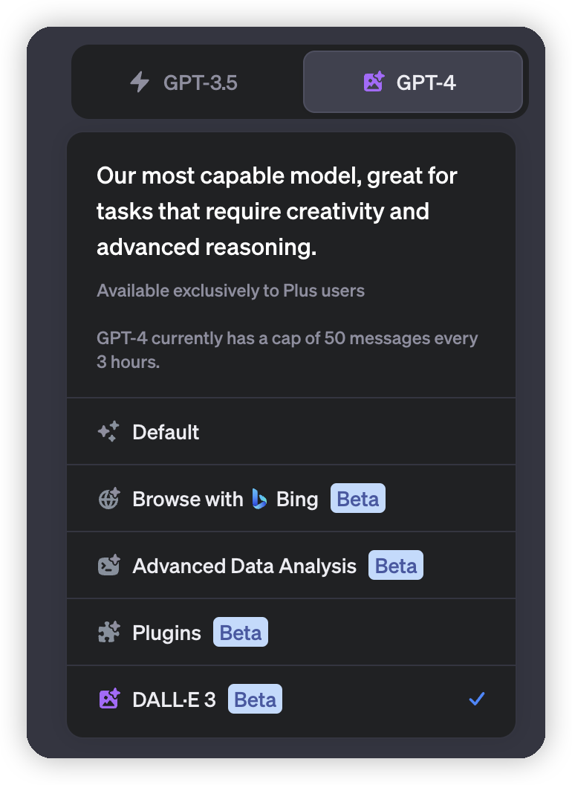
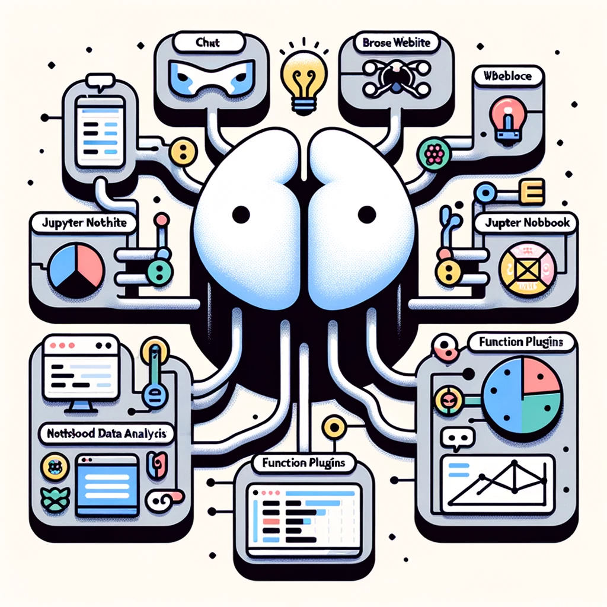
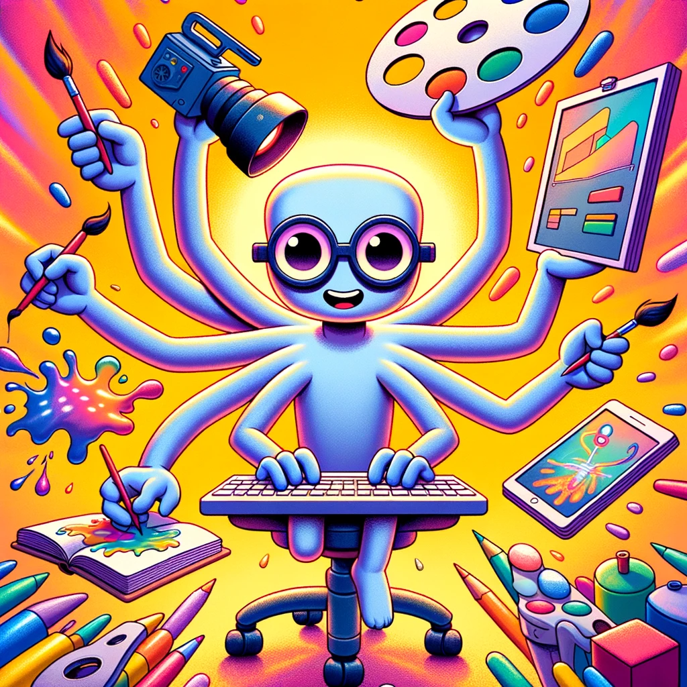
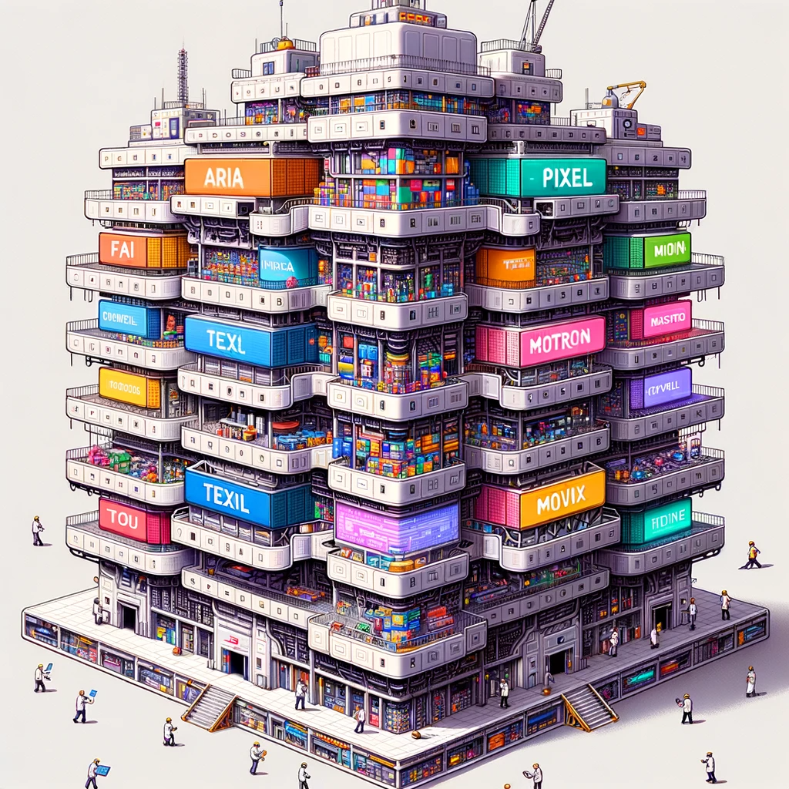
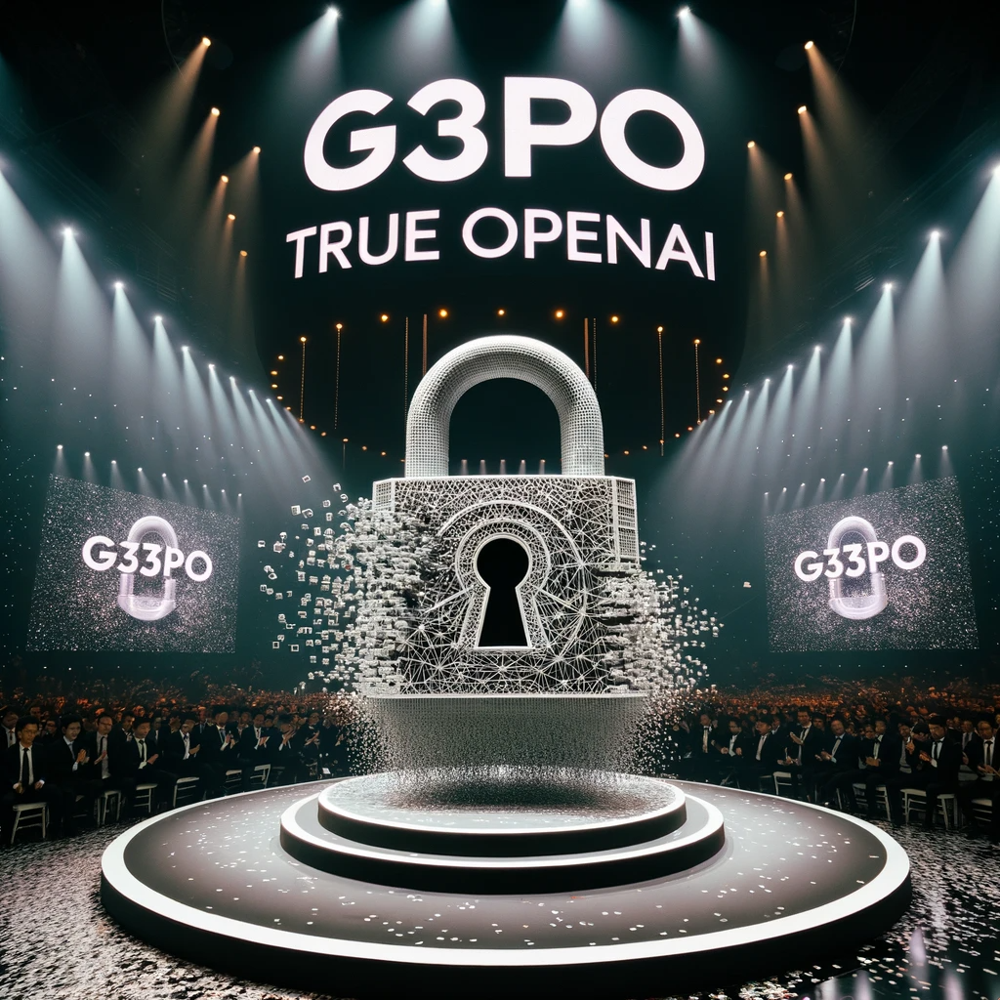
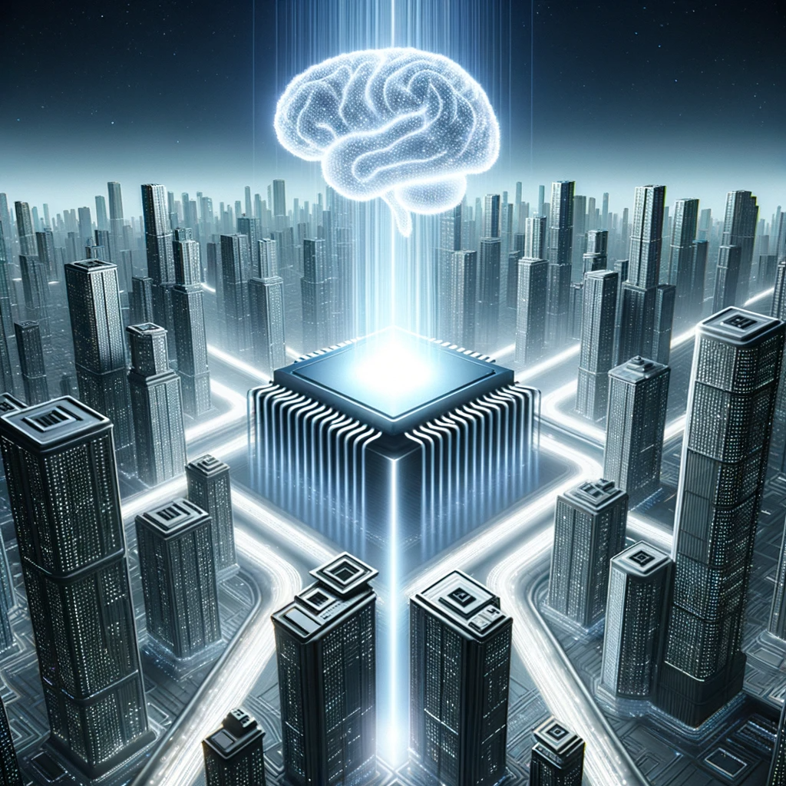

众所周知，OpenAI打算在2023/11/6，ChatGPT问世(2022/11/30)大约1一年以后，召开第一届开发者大会，距离现在还有15天。我们不如来大胆预测一下开发者大会可能更新的所有内容吧！即是预测，也是我对OpenAI接下来开发的功能的期望。你觉得哪种结局最有可能呢？

> 所有图片均由DALL·E 3生成

<!-- more -->

## 大一统结局

目前的ChatGPT Plus我们需要在各种实验性功能中选择一个使用，大家都猜测这背后是GPT4在各种下游任务中特化的finetune版本。大家现在每次只能选一个，直接选择困难症，哪个都想要，但不能同时存在于一个context下。

有没有可能在11.6开发者大会中，OpenAI大一统所有checkpoint，将会使用一个统一的接口做完所有事情：有视觉可以看图，也能上网，能使用工具，还能做jupter notebook执行，最后能用DALL·E 3画图(画出来的图也可以直接用视觉去理解)。

>  大一统结局：ChatGPT Plus的选择困难症可以休矣

<figure class="half">
    
    
</figure>

## 模态联结结局

Google准备训练Gemini多模态大模型抢OpenAI的风头，据知情人士透露：OpenAI准备在Gemini上线之前训练一个多模态大模型Gobi来对抗Google的竞争。如果开发者大会上，Gobi已经训练完成了，Google还有后手吗？

> 模态联结结局：Gobi is all you need

## OpenA(gent)结局

Agent技术目前非常火，过了大约半年，一直没看到OpenAI出手。按照其一惯逻辑，在找到一以贯之的思想之前，他们可能会做总结对比的工作。就像强化学习一样，OpenAI有没有可能推出来一个Agent-gym框架，从此大家开发Agent都是基于Agent-gym的接口和设计理念。

> OpenA(gent)结局：OpenAI的阴影笼罩整个Agent研究。

## True OpenAI结局

虽然之前业界普遍承认最强模型是GPT4，但开源和实际构建应用时大家会选择Llama和Llama2为主。OpenAI事实上并没有真正的Open，在开源界被Meta AI统治了。

因此之前在流传小道消息：OpenAI打算开源一个语言模型，代号是G3PO，也许开发者大会就是G3PO问世的时间，OpenAI用一年时间转形成了True OpenAI

> True OpenAI结局：你的llama3，何必是llama

## 超人主义结局

OpenAI开启了SuperAlignment小组，准备在2030年之前实现AGI。按照他们一贯是先研究、再宣发的特性，保守估计他们在2024年就研究完成了AGI，后面做5年的对齐工作。如果在开发者大会上，他们让AGI技术初步亮相，会不会进一步推进全世界的研究热情呢？

> 超人主义结局：北大的通班不用再办了

## 硅基飞升结局

OpenAI部署各种GPT服务，可能是世界上最缺GPU的人。之前听说OpenAI在研究自研AI芯片，如果OpenAI已经研究出来了AI芯片，可以把GPT4加密打印在门电路里，以后只要买到了GPT4-i7芯片，就能直接通过芯片激活来做推理了。每个时钟周期就是一个流水推理周期，64个周期就能推完64层transformer

> 硅基飞升结局：人类只不过是一段boosting程序，引导硅基生命的到来。

## One More Thing结局

6个月前的WWDC上，库克在发布的结束用一句"one more thing"引出了最重要的Apple Vision Pro发布。OpenAI会不会也在憋一个"终极大招"等着大家在开发者大会最放松警惕的时候引出来。比如有人统计了目前模型的运行速度，发现随着时间推移变得越来越快。有没有可能OpenAI找到了一种把稀疏大模型同时变得稠密的办法。最后来一句王炸。

> One More Thing结局：通过最新的训练方法，我们成功找到了用100M稠密模型比肩100B稀疏模型的办法。

## 快进结局

如果……上面的一切同时发生呢？

> 快进结局：开发者大会马蹄疾，一日看尽长安花！

那么，你觉得哪一种结局最有可能呢？
