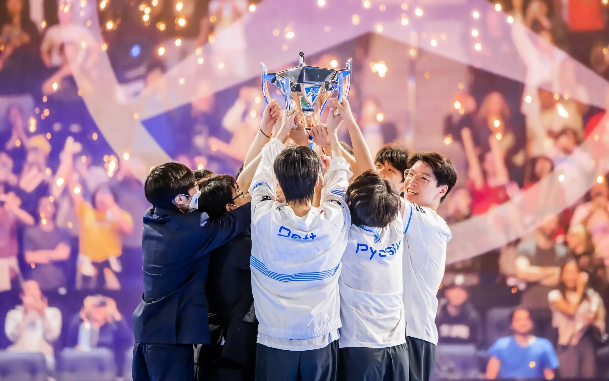
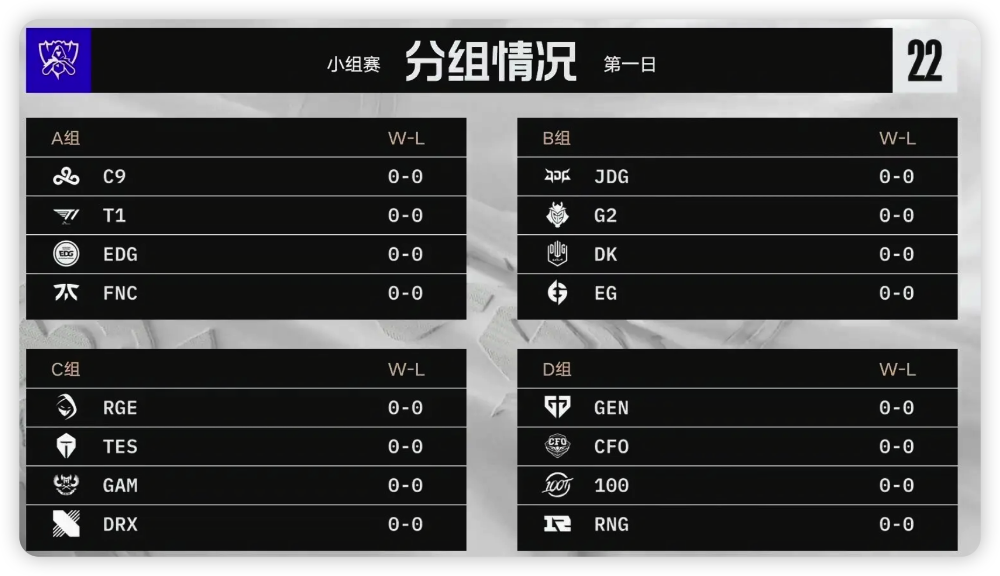
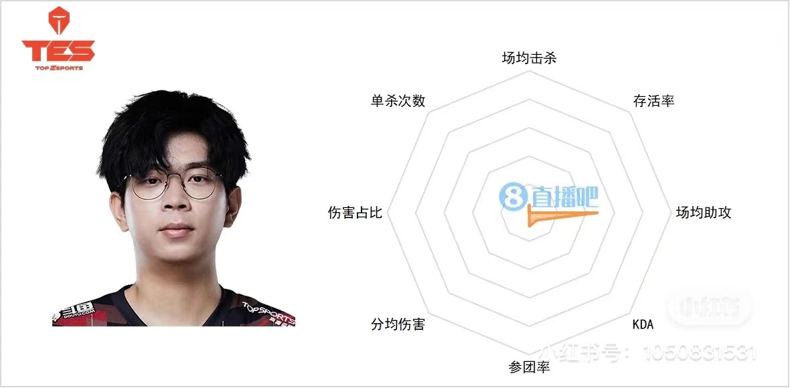
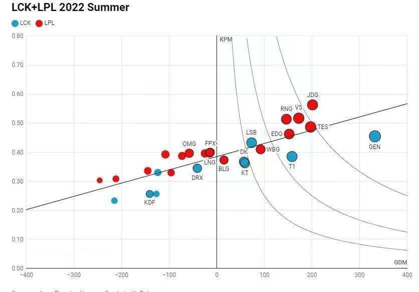

S12决赛在11-6打完结束。正好我几乎看了s12的所有比赛，我也就放在一起，来总结一下s12发生的情况吧。

<!-- more -->

## 入围赛

入围赛12个队伍分成两个小组，一个小组六个队伍，出线4个队伍。小组内单循环，小组第一直接出线，然后小组2,3分别和另外小组的3，2打bo5，赢的两个出线。

在入围赛中，值得关注的就是RNG和DRX，他们被分到了一个小组。正在第一轮的bo1碰撞中，pyosik掏出了一个大树打野，几波团战和视野都碾压了rng，最终赢得比赛。

最后drx全胜小组第一出线，rng小组第二和日本队dfm打了一个bo5。甚至还输了一把(日本队第一次赢lpl小局)，最后以3:1战胜DFM出线。

## 小组赛

加上入围赛进来的4个队，s12一共是16个队进行比赛，lpl和lck都有4个队。

小组赛分4各小组，打双循环，小组第一第二晋级淘汰赛。首先就是小组抽签。

下面我一个小组一个小组的讲：

### 第一组A

第一组其实传统强队T1和EDG分到了一起，梦回s7。然后在赛前大家其实不太看好T1，因为t1在lck夏季赛决赛被gen.g 3:0碾碎。当然EDG在lpl夏季赛成绩也一般，冒泡赛上3:2赢了RNG拿到的3号种子。

不过在小组赛上，gumayusi一转颓势，下路出手双杀了EDG，两把都是碾压获胜。值得一提的是，第一轮FNC战胜了T1，不过在第二轮FNC惨遭edg和t1暴打。最终T1和edg分别以小组第一第二出线。

第二轮的比赛中，T1下路选出了奶妈卡莉斯塔阴间组合，互相保护，天神下凡辅核一奶四。可以说是非常恶心。

### 第二组B

B组在赛前被认为是看点最多的组。大家不清楚G2的真正实力，觉得DK和G2可能要争小组第二了。不过真的打起来以后，发现G2可以说是一碰就碎，谁都没打赢。

JDG打DK可以说是强队碰撞。第一轮canyon掏出大树打野对着Kanavi的野区乒乓一顿反野，可以说是意识拉满。不过最后在yagao的沙皇神奇开团下逆转游戏结局。第二轮Nuguri爆c赢下一把，但是在加赛中Nuguri直接犯病，拿出刀妹counter位对位369剑魔被爆杀。

DK用小组第二为我们带来两个教训：

- yagao的沙皇不能放
- 别拿刀妹打剑魔

JDG最终以小组第一出线

### 第三组C

第三组就是搞子来了。赛前大家都觉得第三组最没看头，TES稳稳拿下。结果在第一轮RGE会出手，上来三板斧，3:0横扫c组，欧洲观众直接站起来了，都觉得RGE可以夺冠。

TES不负众望，分别在对阵RGE和DRX的比赛中落败。值得一提的是，JackeyLove选出德莱文装杯被杀穿。第一轮结束，TES位居小组第三。

第二轮RGE现出原型，原来还是原来的三板斧：中单战士，上单肉墩，打野节奏怪。被研究清楚以后RGE直接被DRX和TES爆杀。

第二轮，比赛从凌晨三点TES对阵越南队GAM开始，大家都订好了5点和8点的闹钟看TES打DRX和RGE。最终在3点TES输了GAM，确定无缘淘汰赛。值得一提的是，TES哥在对面水晶前没有a基地而是打人，最终被GAM水晶丝血翻盘。

粉丝们5点钟起来看TES哥输越南队表明态度。无所谓，knight会出手，TES接连大优势碾压DRX和RGE表明实力，嘻嘻哈哈游回家。wayward世界赛6维图如下：

虽然大家都在喷wayward，但我倒是不这么认为。主要是TES的战术体系是保下路牺牲上路，小Tian刷野抓人也偏重于下路。wayward本身被放弃：bp拿不到英雄，游戏见不到打野，后期把线让给队友，当然发挥不出来了。关键在于，下路拿到优势了吗？这一点可能才是TES游回家的关键。

当然，在c组的小组赛中，虽然输了两小局，但deft和BeryL的精彩表现，尤其是大头艾希的下路组合。向我们展现出了LCK下路的战术储备和英雄池深度。

### 第四组D

D组的看点主要是GEN.G和RNG。GEN.G在赛前被认为是夺冠大热门。不管是分均经济差还是人头差，gen.g都领跑全场。从以往几年经验来看，这个图高的最后都夺冠了。

然而，第一轮GEN.G就被RNG打败了。RNG选出赶尸中野冰女破败王直接找小规模多打少，邦邦两拳GEN.G还真没挡住。当然，也有人说是第一轮lehands直接搞了个怪的炼金塞纳组合，连刀都补不到。

不过，第二轮GEN.G调整状态，双杀RNG最终还是小组第一出线了。不过看起来，没有泽丽的ruler确实有点没内味了。最终RNG小组第二出线。

小组赛完了就是淘汰赛，淘汰赛下次接着聊。
