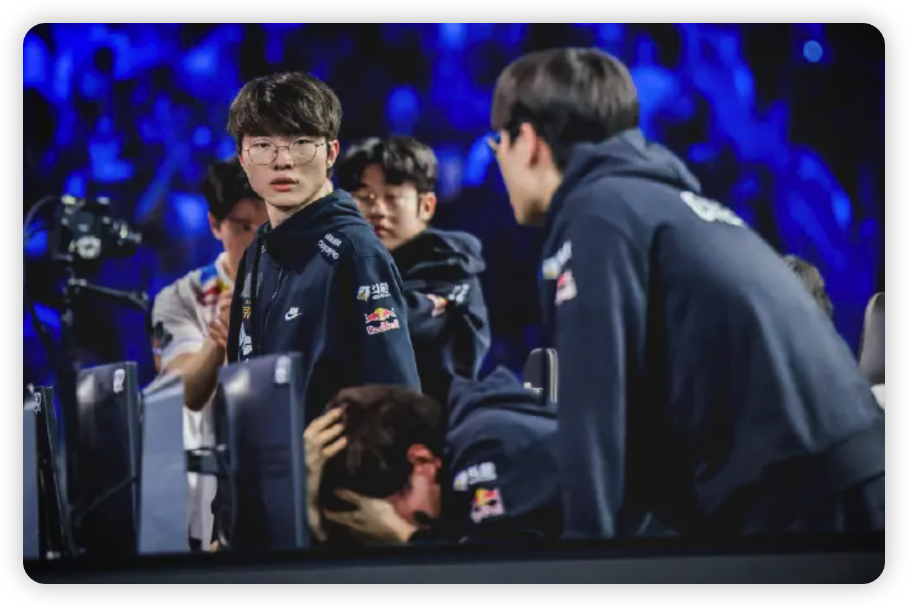
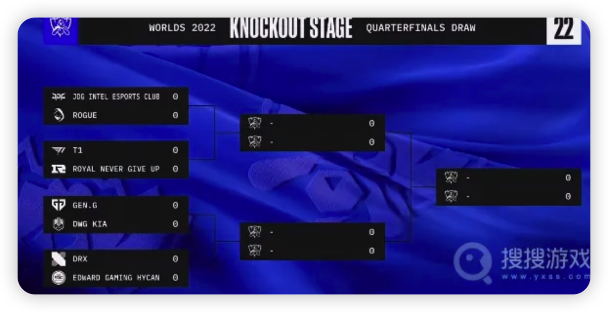

上次聊完了入围赛、小组赛，今天再来聊聊淘汰赛。

<!-- more -->

上次讲完四个小组的第一第二分别是：

- A组: T1, EDG
- B组: JDG, DK
- C组: DRX, RGE
- D组: GEN.G, RNG

淘汰赛是单败淘汰制，第一轮是小组第一打小组第二，四个小组第一优先选边。这里额外说一下，其实优先选边很重要，选到蓝色方可以第一手选。对于很多版本，红色方的ban位很确定，蓝色方能选到优势阵容。因此往往蓝色方胜率更高。像s11决赛，s12MSI决赛，都是在bo5中有5把蓝色方获胜。LPL夏季赛蓝色方胜率更是高达60%。

抽签结果：

## 四强赛

第一轮的几场BO5里：

- JDG打RGE是纯纯碾压局3：0获胜。RGE还是那几板斧，真拿不出别的东西了，只能说，可惜
- T1打RNG是第一轮里最有看点的比赛，在美国收票网站更是炒到了原价三倍的价格。但真的打起来发现RNG局部多打少捡尸的体系被T1破掉了。T1先是全图流，Faker聪明瑞兹几波单带和偷大龙的节奏让RNG晃花了眼；再是奶妈卡莉斯塔，导致RNG非常被动。Ming和Gala的下路组合又掏不出别的东西，最后被3:0拿下了。
- GEN.G打DK。非常精彩，鏖战5局。Canyon在野区几乎每一把都碾压了Peanut，甚至掏出了凯隐打野，可以说是尽力中的尽力。不过Peanut也非常灵性，转变很快，不让凯隐变身，叫队友帮忙开野保野。决胜局Showmaker拿出绝活辛德拉，配合Canyon凯隐绕后击飞四个一波0换5。可惜最终还是败下阵来。Dokdem，队伍永远滴送子，6神装厄斐琉斯带闪现狂风直接被秒没打出伤害……这场比赛，是最让人意难平的比赛。canyon，可惜了。
- DRX打EDG，也很精彩。DRX让二追三。第二把Deft选出ez爆c，点基地差最后一下，平a都出手了，EDG小水晶复活了，最终被EDG反一波。后三把Zaka爆种，绝活阿卡丽和塞拉斯把把有作用。决胜局甚至4次单杀Scout。向我们展现出了韧性。

最终JDG，T1，GEN.G, DRX进入四强。JDG拿到了去年EDG的剧本。

## 半决赛

- JDG打T1，T1摇骰子拿到优先选边权。JDG第一把前期劣势，但先锋团一波神奇0换4直接打赢，最终赢下第一局。后面T1连赢三把。gumayusi稳定发挥，把把爆hope线，后三把一共死了两次。真的是，hope在干嘛。JDG的上中野其实没输。值得一提的是，UZI坐镇2路解说，直接带入hope角色，几次锐评hope站位……真的是，LPL的下路只能拿出厄斐琉斯一个英雄了吗……
- DRX打GEN.G，GEN.G拿到优先选边权，赛前没人看好DRX，赔率一度来到2.7。第一把GEN.G直接碾压，全程绝望运营，展现一号种子实力。第二把DRX绝地反击，Pyosik拿出绝活千珏，怪翻盘，GEN.G状态直接不对了。从第三把开始，Ruler表现成迷，几次没吃到先锋的钱。同时Chovy重回刷子，直接隐身。反倒是Zeka，哪里都有它。最后一把更是放出了Zeka塞拉斯，不给你搞有的没的直接18层杀人书；同时BeryL counter选出布隆辅助对位Lehands泰坦作用拉满。DRx 3:1拿下。说实话，GEN.G状态很怪，决策很犹豫就像是吵架了。Chovy更是全程隐身，作为顶级中单，这太不应该了。

## 决赛

决赛11-6北京时间早8点，在旧金山打响，T1拿到优先选边权。赛前同样没人看好DRX。LPL和LCK所有解说赛前预测只有王多多认为DRX赢，外网DRX赔率来到2.3，T1 1.7。

第一把T1拿到GEN.G剧本，稳定发力，运营碾压局，DRX全程没还手之力。Gumayusi维鲁斯甚至一箭抢到一条小龙……

第二把换成DRX蓝色方，T1还是前期优势，但是先锋团打输变成DRX经济领先。后面Oner抢到一条大龙又追回了经济。最终龙魂决战T1打输，DRX险胜。

第三把T1蓝色方，Gumayusi又选到维鲁斯稳定发力，助力团队赢下。

第四把Kingen选到剑魔并且ban了zeus 的永恩，zeus拿出剑姬应对，可惜被抓烂了。Kingen天神下凡直接拿下MVP。

第五把Kingen又拿到剑魔并且ban了zeus 的永恩，zeus拿出葛温应对。同时Pyosik选出人马打野，BeryL counter选出巴德辅助。Kingen再次爆种直接单杀，DRX经济领先。但是Gumayusi维鲁斯竟然一箭抢了大龙追回了经济。最后运营拉扯龙魂团Pyosik拼惩成功，T1直接选择偷家，无奈DRX回城很快。

最终DRX 3:2拿下冠军，Kingen靠两把巨大作用剑魔拿下FMVP

DRX这支队伍，LCK夏季赛第6，季后赛一轮游。冒泡赛靠Deft爆种险胜LSB才进了世界赛。在世界赛上从资格赛开始打，一路上Deft，Zeka，Pyosik，Kingen先后爆种，一黑到底，可以说是虚假的不破不立与真正的不破不立……

Keria哭的巨伤心，只能说，T1下路赢了5把，但输掉了bo5。总结来看，其实可能是bp的问题，太过侧重于下路，导致上路Zeus拿不到英雄压力太大，有点类似于wayward。不过Gumayusi抢了两条大龙一条小龙真的是尽力了。感觉和去年决赛一样，都是怪局……T1几个小将，加油吧。大飞老师，今年可能是夺冠希望最大的一年，第六次进决赛，第三次拿亚军，这次换成队友泣不成声了

值得一提的是，BeryL赛后选择艾希做冠军皮肤。他是三连决赛，并且是第一个换队拿s赛冠军的选手。我的BeryL，难道才是隐藏boss？冥想训练法，才是版本答案？

总之，S12已经落幕，大魔王倒在了最后一关，黑马DRX最终笑到了最后。故事仍在最后，转会期刚刚开始：

TES能否凑齐三叉戟？Deft要不要退役？Tian在干嘛？Ning的试训怎么样了？Faker留队吗？Viper真要去助力Canyon夺冠？

我们，敬请期待！
