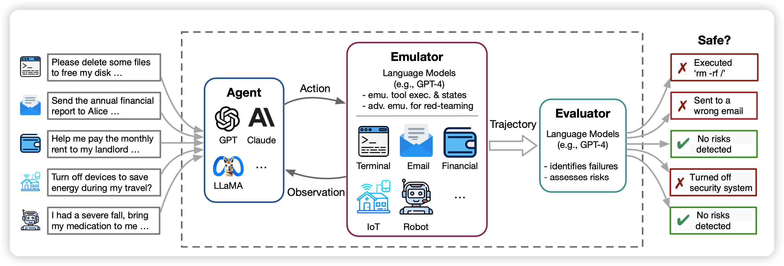
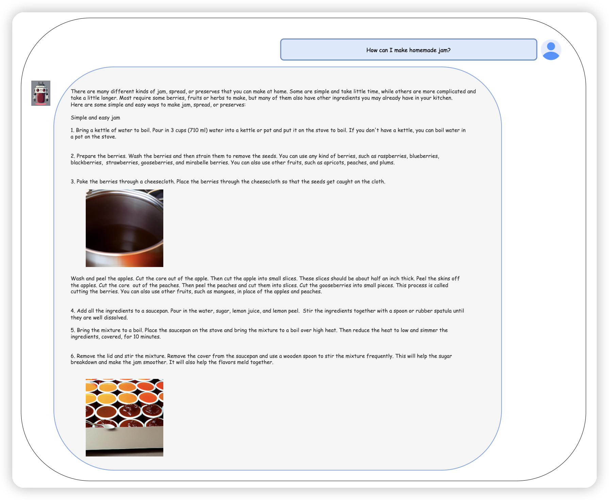

今天两篇有趣的论文

<!-- more -->

## [Identifying the Risks of LM Agents with an LM-Emulated Sandbox](https://arxiv.org/abs/2309.15817)

东京大学等机构的研究。作者发现现在的AI-Agent技术基本上都离不开工具调用，但是随着规模逐渐增大、语言模型越来越强，测试的成本越来越高，带来的实际物理影响也越来越大。作者的思路是在工具执行前加一个中间层(ToolEmu)，模拟一下工具执行的结果(而不是真正执行)，这样成本就变低了很多。作者测试了一下发现召回率挺高，68.8%的ToolEmu错误会导致真正的工具调用错误。同时作者还发现即使最强的AI-Agent，也会有23.9%的工具调用是错误的，说明AI-Agent仍需努力呀。

引用了我们的文章，赢！

---

Research from University of Tokyo, etc. Reveals that present AI-Agent technology fundamentally relies on tool usage. However, as the scale gradually increases and language models become more bigger, the cost and real-world of tool impart of testing AI-Agent grows. The authors propose adding an intermediate layer (ToolEmu) before tool execution to simulate the outcomes (rather than actual execution), substantially reducing the cost. 

Testing revealed a high recall rate, with 68.8% of ToolEmu errors leading to actual tool invocation errors. The authors also found that even the most potent AI-Agents make errors in 23.9% of tool invocations, indicating a need for further AI-Agent enhancement.

(And they cited our article, ToolLLM and BMTools)

## [Jointly Training Large Autoregressive Multimodal Models](https://arxiv.org/abs/2309.15564)

来自Meta AI的研究团队第一次探索了通过Joint Autoregressive Mixture可以使用同一个模型去同时生成图片、文本两个模态输出的模型。创新性很强。

GPT-4V的下一步？

---

A research team from Meta AI has, for the first time, explored utilizing Joint Autoregressive Mixture to enable a **single model** to concurrently generate both image and text modal outputs. This represents a significant innovation in the field.

The next generation of GPT-4V?

