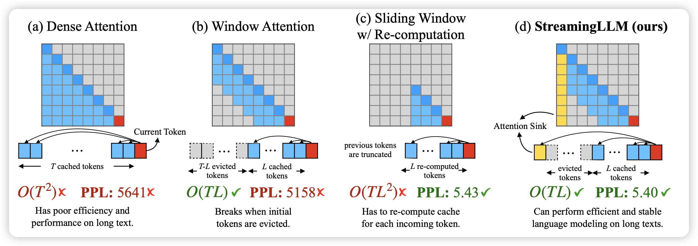
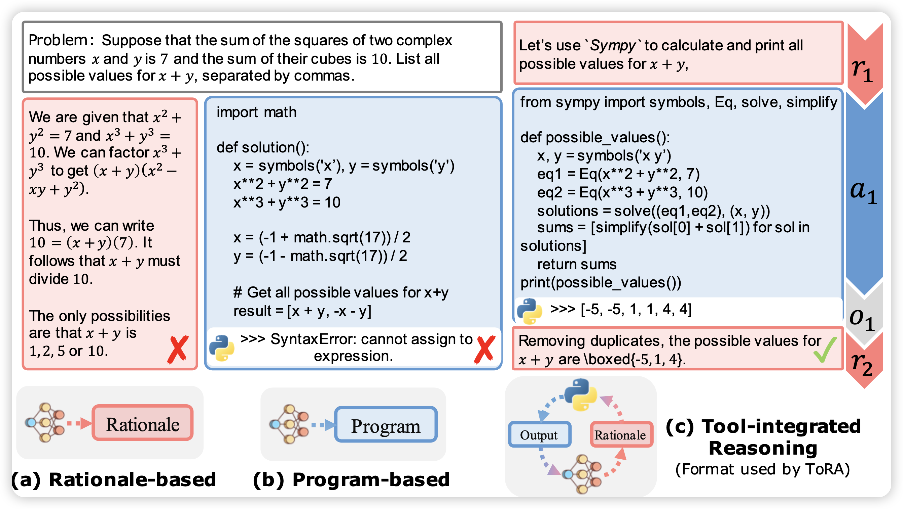

今天两篇有趣的论文

<!-- more -->

## Efficient Streaming Language Models with Attention Sinks

这篇我计划更新成阅读笔记。作者发现了Llama2等LLM attention中的bias现象，主要取决于最前面的4个token。于是作者发现只要每次在sliding windows上都拼上最前面4个token的情况，就能在无限长文本上每次都获得全局的文本信息。从而达到流式处理的效果。

## ToRA: A Tool-Integrated Reasoning Agent for Mathematical Problem Solving

推一推清华黄民烈老师在工具学习领域的作品，让LLM可以通过写代码工具来做多步调用进而完成数学问题推理。然后用一个类似STaR方法的两阶段训练方式来训练模型：

- 首先是保留做对的trace
- 然后是对于做错的trace，用一个老师模型去correct，然后再扔进数据集

是第一篇开源的在MATH数据集上超过50% acc 的模型

