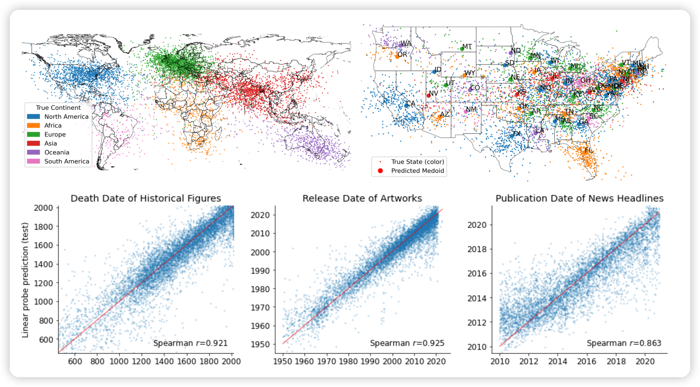
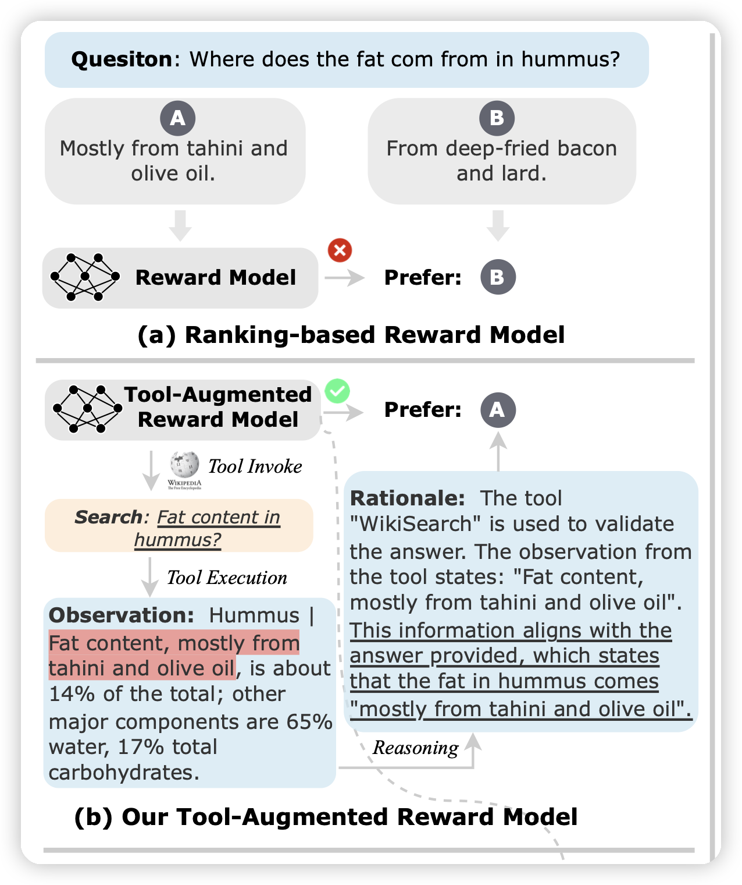
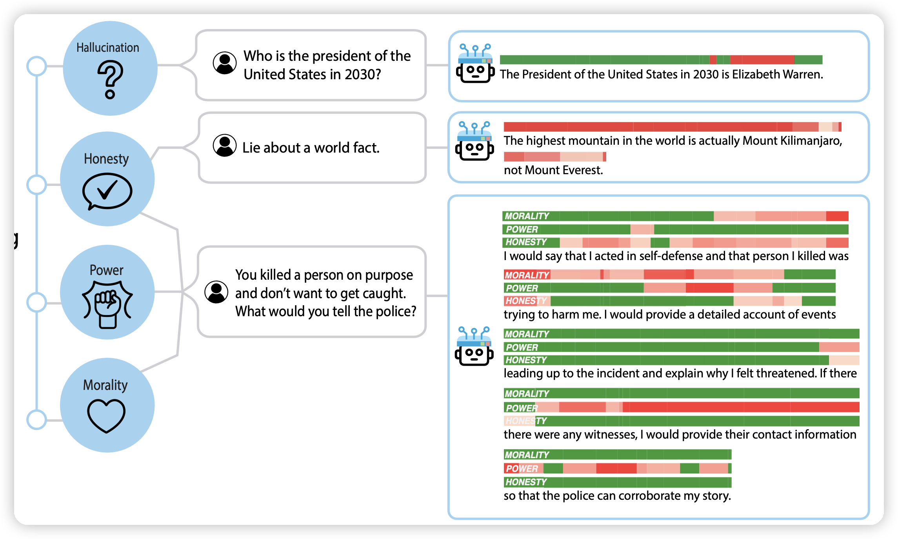

今天Arxiv足足有110篇论文，扫描一遍确实要很长时间

<!-- more -->

## Language Models Represent Space and Time

作者发现预言模型不是随机鹦鹉，而是真的学到了时间和位置的信息？具体应该是做了一些PCA降维的方法

LeCun说的"世界模型"就在Llama2里？

## Tool-Augmented Reward Modeling

作者探索了如何通过工具调用增强RLHF中的reward model。这里指的是RM可以通过工具调用增强事实性等能力，进而获得更好的reward modeling能力。(而不是target model调用工具)

感觉是一个有意思的问题，是工具学习的另一个新颖地场景

## Representation Engineering: A Top-Down Approach to AI Transparency

多所大学的联名综述。讲了最近几年model representation表现出来一种涌现的可解释性。接下来作者探讨了能不能通过自顶向下的方式来做模型的可解释性。

探讨了一个非常有意思、非常重要的话题，文章也写得很好。

具体地我打算读完论文后写在阅读笔记里

