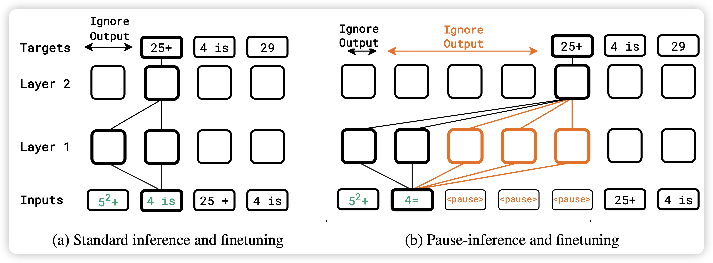
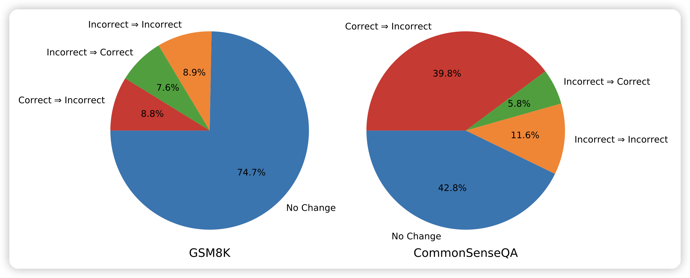

今天两篇有趣的论文

<!-- more -->

## Think before you speak: Training Language Models With Pause Tokens

很有意思的文章，作者认为：在模型生成比较困难的地方，加上一些pause token，会不会让模型训练地更好？

在C4上训了100M到1B的模型，发现在下游任务(尤其是推理任务)上，取得了很大的提升。引发了对于auto-regressive manner很多的思考

## Large Language Models Cannot Self-Correct Reasoning Yet

Google Deepmind的论文，是一篇分析性文章。作者探索了self-correct类的技术，发现目前的模型没有外界反馈，基本上不可能做self-correct

> 想起来小时候考试：老师每次对着我说"这个题再看看？"，最后都改错了……原来是缺少外界反馈呀

