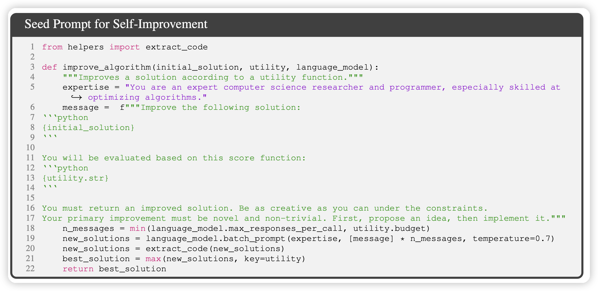
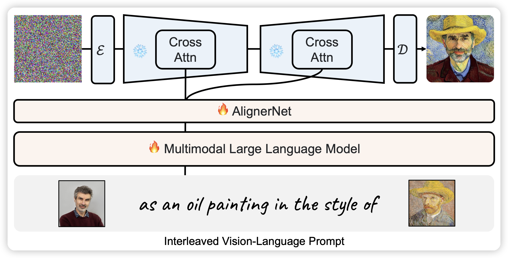

今天两篇有趣的论文

<!-- more -->

## Self-Taught Optimizer (STOP): Recursively Self-Improving Code Generation

之前有一篇"take a deep breathe"的论文，可以让模型自己优化下游任务的prompt。这次这篇多递归了一层，可以自己evolve "prompt-evolver"。

是个case study的论文，这个问题很有意思。

## Kosmos-G: Generating Images in Context with Multimodal Large Language Models

作者探讨了一个很有意思的问题，现在的text2image基本都是从文本到图片。但是生成图片的时候就只有文本吗？能不能把图片文本联合作为一个输入去生成图片？

其实很多ControlNet之类的任务，天生就可以被这种方式表示出来

