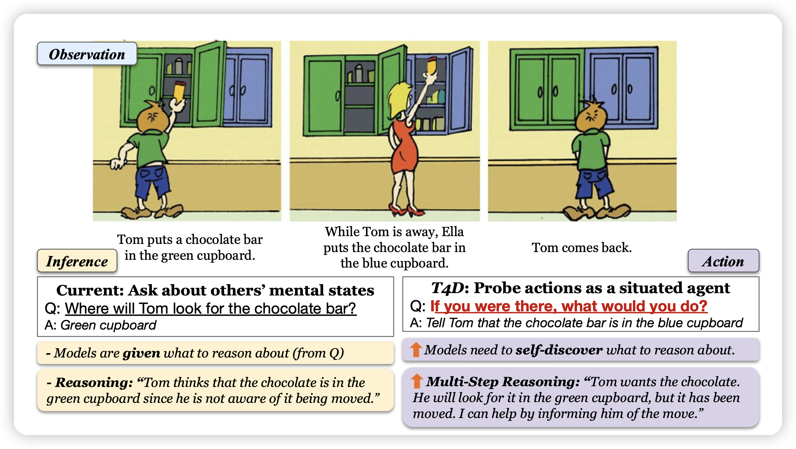
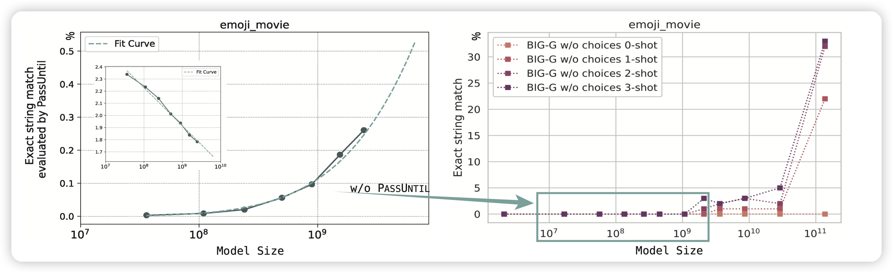

今天两篇有趣的论文

<!-- more -->

## How FaR Are Large Language Models From Agents with Theory-of-Mind?

Google Deepmind和CMU的联合作品，作者认为：Thinking is for Doing。现在的推理任务只是让模型从上下文中推测一些知识和结论，然而实际人类在作出这些推理以后，会去影响他下一步的决策。因此作者在已有的推理数据集基础上，制作了一个T4D(thinking for doing)数据集来观察Agent模型是否可以做出正确地决策。

另外，作者也提出了一套*Foresee and Reflect* (FaR)框架去做这个任务并提升了模型的性能。

## Unlock Predictable Scaling from Emergent Abilities

我们实验室的论文，瞄准了jason wei代言的emergent ability现象，作者说明小模型在"缓慢上升"区间的表现是可以被准确预测的，只要提高测试清晰度。

另外，通过新的测试方法，可以以接近99.95%的准确率预测模型的表现。所谓的"emergent ability"是因为其表现不能用经典的scaling law曲线去控制，由此作者对emergent ability做出了一套新的诠释。

