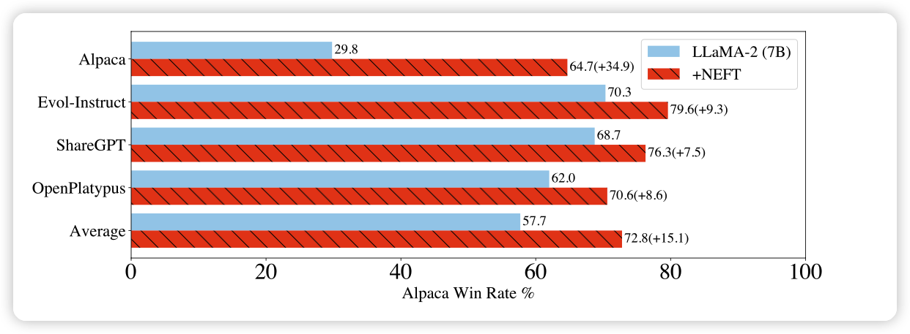
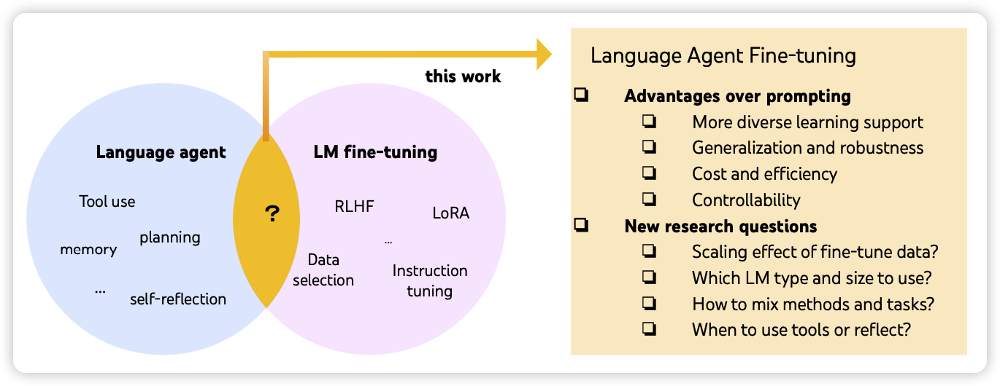
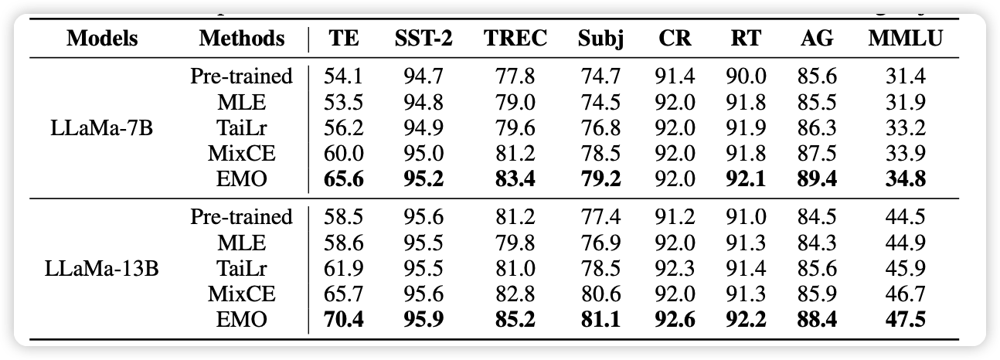

今天竟有172篇论文？EMNLP放榜了，大家纷纷挂Arxiv

## NEFTune: Noisy Embeddings Improve Instruction Finetuning

作者发现，仅仅在finetune时给embedding添加噪声，竟能大范围提高模型表现？

感觉这里面肯定隐藏着更深层次的原因

## FireAct: Toward Language Agent Fine-tuning

作者首次探索了在Agent里引入finetune会带来什么，发现仅仅500条GPT4标注数据就可以让模型在下游任务上获得非常大的提升

## EMO: Earth Mover Distance Optimization for Auto-Regressive Language Modeling

作者目标直指crossentropy loss，发现换掉这个，表现猛涨

具体来说作者选择用earth mover distance来表征损失，有点像之前的维因斯坦GAN。

