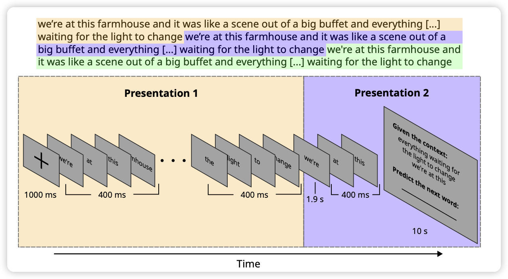
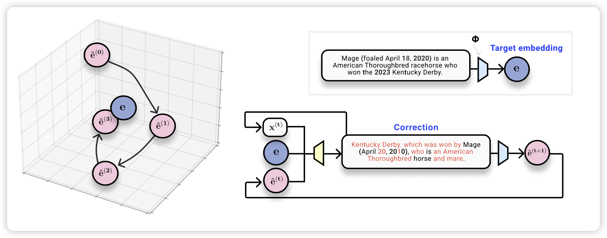

今天论文也不少，找了三篇研究的问题比较有意思的。

## Humans and language models diverge when predicting repeating text

LLM使用next token prefiction任务进行训练，作者探究了一个问题：如果输入一直重复，人和LLM的表现会一致吗？

作者发现前面几次语言模型的表现比较接近，但是后面就会体现出差距。作者深入forward内部，发现是什么导致了这种现象。挺有意思的一篇实验论文

<!-- more -->

## Text Embeddings Reveal (Almost) As Much As Text

EMNLP的论文。大家都知道dense embedding含有原始输入的信息，但是具体含有多少信息？作者尝试了一个反向训练的办法，从dense embedding反向解码输入，发现基本上32 token的embedding都可以无损解码出来。(即使dense embedding不是通过reconstruction进行训练的)

> language modeling is compression?

## SWE-bench: Can Language Models Resolve Real-World GitHub Issues?

和之前微软的那篇CodePlan有点像，也是在多文件场景下做code refine。作者爬了很多github issue和pull request的代码修改对，做了一个benchmark，看模型在多文件修改场景下的表现。

> 单文件下表现很好的模型，在多文件场景下都原形毕露了……

