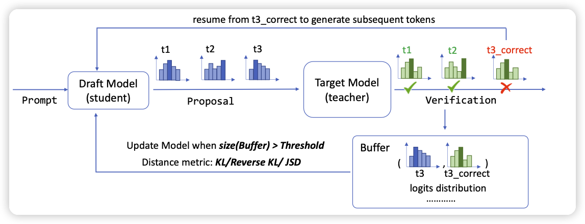

## The Temporal Structure of Language Processing in the Human Brain Corresponds to The Layered Hierarchy of Deep Language Models

比较有意思的研究问题。作者用脑波检测技术统计了志愿者在30min的对话里的大脑活动。同时把同样的文本输入到GPT2-XL内，发现人脑的激活情况与GPT的激活情况非常相似。用一个简单的分类模型输入GPT2的激活情况，通过简单的训练，就可以预测出人脑的激活情况(尤其在层数高的attentionLayer)。说明了预训练模型的认知结构和人脑的认知结构有一定的相似性。

## Online Speculative Decoding

在投机推理的场景，都是由小模型生成样本，由大模型决定是否采用。在实际应用中，user query往往来源于一个同质化的分布，小模型错的地方也有相似性。作者发现目前系统的效率很低，因为小模型是固定的。因此想要做在线的部署，对于错误的预测都记录下来，当做一个训练数据。每当数据集超过阈值，就更新一波小模型。

通过这种方法，让小模型的部署时接受率从10%提升到了65%。非常有意思的观点。

