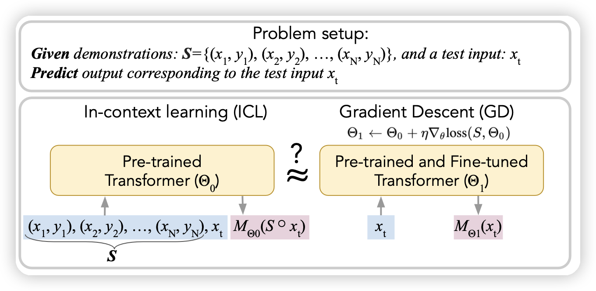
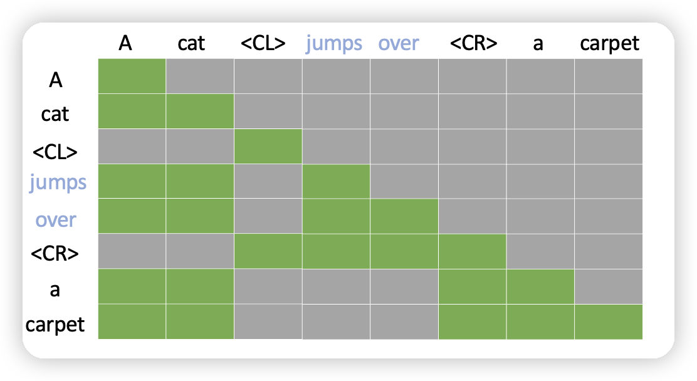

## [Do pretrained Transformers Really Learn In-context by Gradient Descent?](https://arxiv.org/abs/2310.08540)

之前有篇论文说transformer-casual-MASK有一个特性，前面放in-context样本，在预测后面的时候，模型的参数类似于对前面的样本做了一些梯度下降。

作者说明之前推测里面用到的假设实际影响太大，和实际训练模型的setting差距过大。作者用Llama做了实验，发现了这两种假设在实际表现上的不匹配，说明了目前的假设还需要进一步的论证。

## [Context Compression for Auto-regressive Transformers with Sentinel Tokens](https://arxiv.org/abs/2310.08152)

作者瞄准长文本领域attention计算的$n^2$复杂度，想了一个简单的办法：能不能把一些token消除掉，用一个哨兵token代替。然后让矩阵计算的时候变成稀疏的attention矩阵。有点类似之前的sparse-attention

