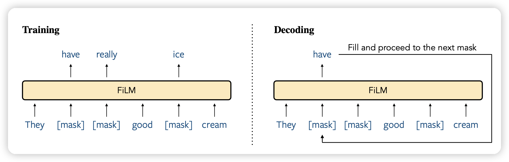
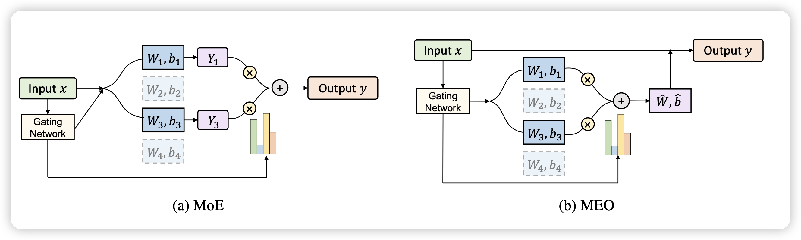

今天135篇论文，重量级。EMNLP的余波还在。很多论文我不太感兴趣，分享两篇有趣论文

## [FiLM: Fill-in Language Models for Any-Order Generation](https://arxiv.org/pdf/2310.09930.pdf)

Yejin Choi的论文，不知道是不是打算发在COML上:)

这篇瞄准了auto-regressive的建模方式，训了一个模型通过fillng in的形式做文本建模，每次解码一个[MASK]，最终恢复出来文本。发现在scaling以后，他的表现和left-to-right的效果变得接近，同时做in-filling的能力远胜。

> 有点像是去年比较火的Diffusion-LM的感觉？

## [Merging Experts into One: Improving Computational Efficiency of Mixture of Experts](https://arxiv.org/pdf/2310.09832.pdf)
作者提出了一个问题：MoE虽然好，但是experts多起来以后计算资源膨胀还是很多的。作者想要找到一个算法，可以增加专家数量时计算复杂度涨的不多，提出了一个Merging Experts into One的办法。

计算资源省了几倍，效果甚至还涨了($83.3\% > 82.6\%$)

