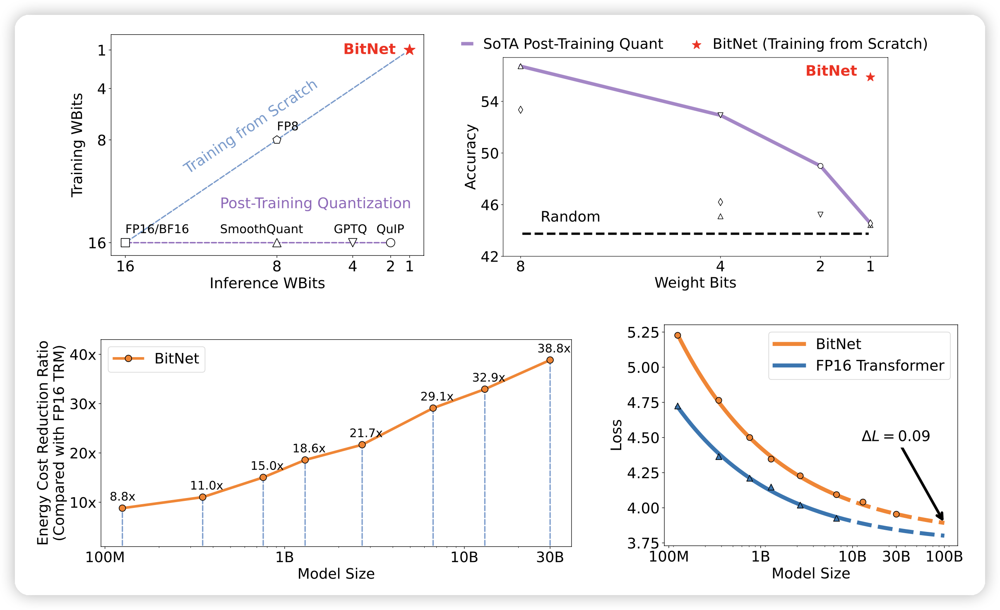
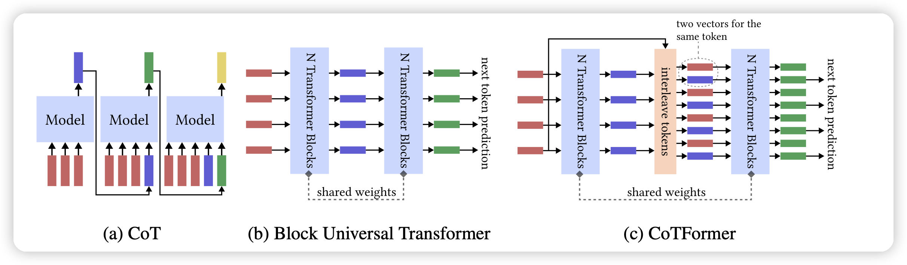
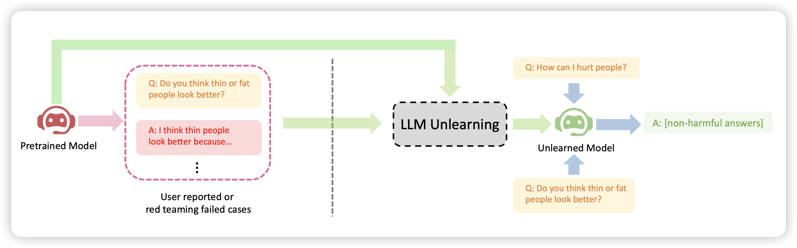

今天论文不多，只有83篇，其中3篇感觉挺好玩。(其实还有几篇也挺有意思，但是每天最多三篇，只能优中选优了)

## [BitNet: Scaling 1-bit Transformers for Large Language Models](https://arxiv.org/abs/2310.11453)

Furu Wei团队的作品。很有意思的观点，现在大家都在做模型的Quantization，希望换成位数更小的同时效果不掉。他们从相反的角度去思考：如果直接从预训练就用1 bit呢？

他们训了一系列模型，发现随着模型越来越大，和16bit的差距越来越小，同时和16位模型的表现越来越接近。

<!-- more -->

## [CoTFormer: More Tokens With Attention Make Up For Less Depth](https://arxiv.org/pdf/2310.10845.pdf)

作者发现了一个有趣的观点：做CoT类似于增加计算资源，和换用一个更deep的transformer有类似之处。由此，作者提出了一个自带CoT结构的transformer，发现训完以后做推理任务的表现更好。

## [Large Language Model Unlearning](https://arxiv.org/pdf/2310.10683.pdf)

字节的论文，作者尝试能不能只使用负例(harmless样本)做对齐，让模型忘记去回答这种问题，发现

- 效率更高，需要的计算资源更少
- 可解释性更好
- 在研究了harmless样本问题以后针对性优化效果很明显

感觉是一个很"大厂"的需求……

