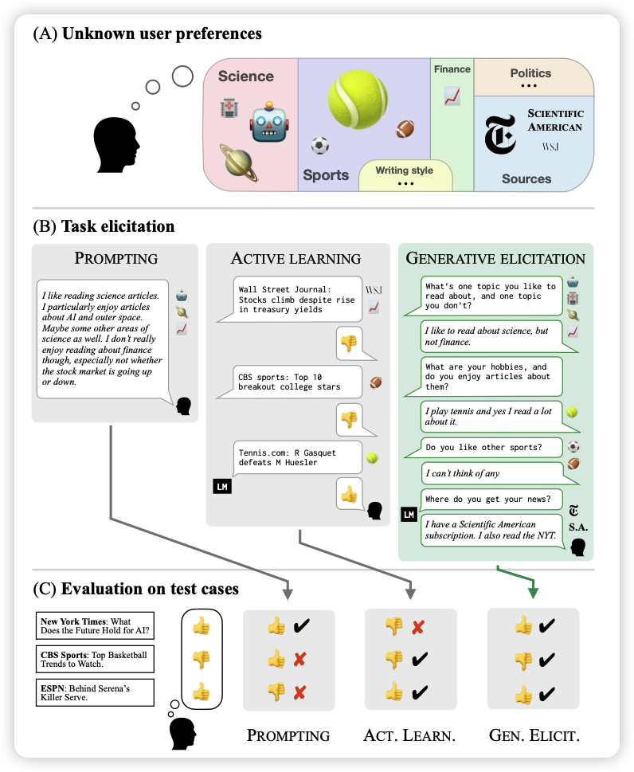
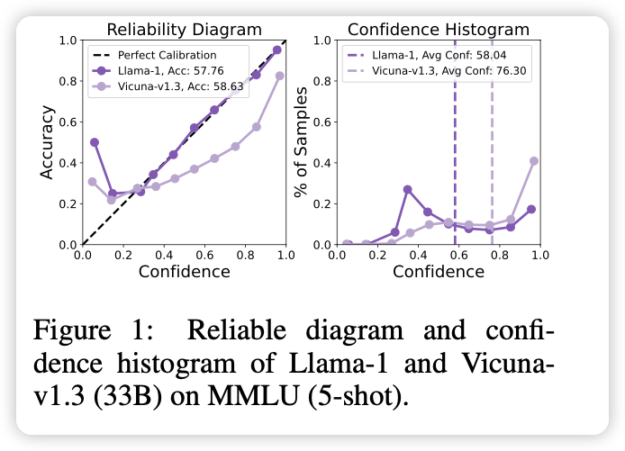

今天有74篇论文，有趣的有3篇

## [Superiority of Softmax: Unveiling the Performance Edge Over Linear Attention](https://arxiv.org/pdf/2310.11685.pdf)

这是一篇数学论文，里面一个模型图都没有。讲的问题是Linear Transformer获得了线性的复杂度，但基本上表现都比不上普通Transformer，作者认为这里面的根本原因就是softmax算子。接下来作者做了一系列证明来说明softmax算子在表征能力上为什么会提高Transformer数学结构的上限。

## [Eliciting Human Preferences with Language Models](https://arxiv.org/pdf/2310.11589.pdf)

stanford、MiT、Anthropic的联合论文，探讨了一个简单的问题：align领域能不能做active learning，不是模型去被动的生成答案让human去打分，而是模型去主动地和human沟通来做对齐。

很新颖、很符合直觉的想法，我很喜欢，我愿意颁给他ICLR Oral

## [Investigating Uncertainty Calibration of Aligned Language Models under the Multiple-Choice Setting](https://arxiv.org/pdf/2310.11732.pdf)

朱军老师组的作品。探索了一个简单的问题：为什么LLM emergent出来的calibration的性质，在RLHF以后消失了呢？

作者详细探索了这个现象，同时提出了一个简单的办法可以从一个RLHF模型中恢复出来calibration的性质，是一个很有意思的思路。

