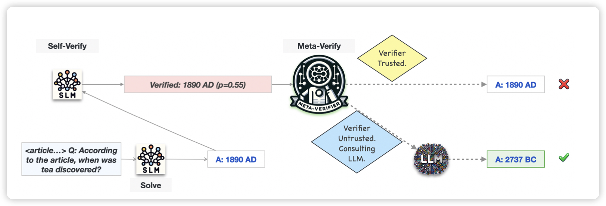
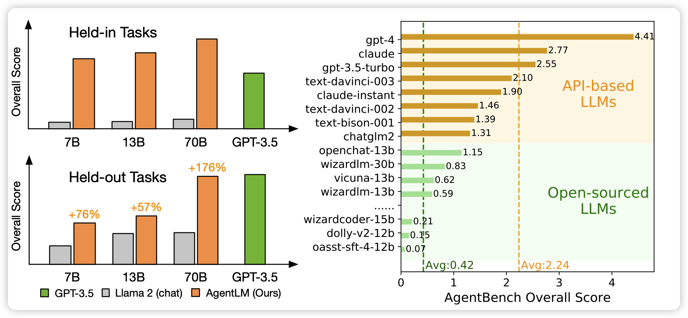

## [AutoMix: Automatically Mixing Language Models](https://arxiv.org/pdf/2310.12963.pdf)

deepmind的新工作，面向一个很简单的问题：现在有一大堆模型的API，每个和每个的价格都不一样、能力也不一样。有没有什么异构的办法，可以把不同的query route到不同的模型，来节省成本同时表现不掉？

作者提出的方法是用一个弱模型先跑，根据结果做route，能节省大约89%的成本：降本10倍！

## [AgentTuning: Enabling Generalized Agent Abilities for LLMs](https://arxiv.org/pdf/2310.12823.pdf)

唐杰老师组的工作。是之前AgentBench工作的后文，他们通过Agentbench上的任务构造了一个Agent数据集，然后用类似FiRe-ACT的方式训练了Llama，取得了不错的效果。

最近的Agent的工作开始逐渐出现了训模型的趋势，不知道这是历史的倒车还是正确的方向。

