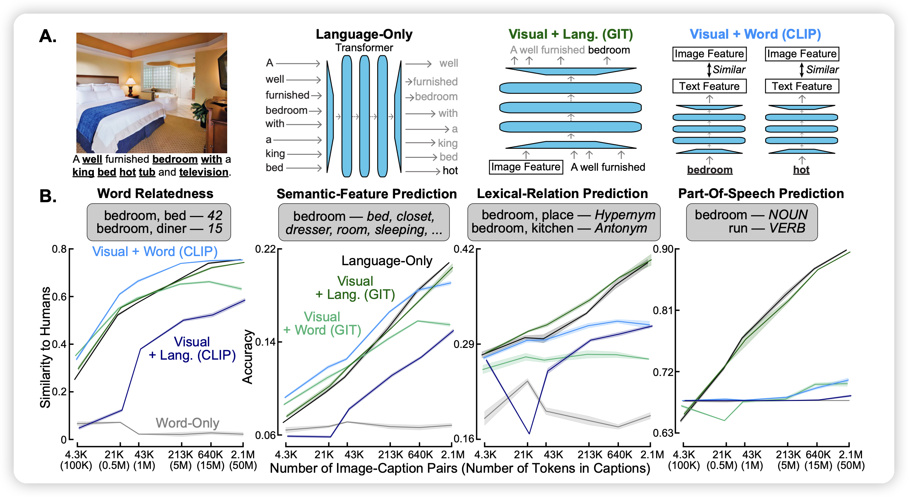

梁山好汉108，今天也出来了108篇论文。按照每周周二最多的逻辑，周二绝对更是重量级。

## [Visual Grounding Helps Learn Word Meanings in Low-Data Regimes](https://arxiv.org/pdf/2310.13257.pdf)

作者提到，目前的语言模型只在文本上训练next-token-prediction,语义里的概念元组没有和真实世界对应起来。作者尝试了一个word-learning，和人类一样从简单的word开始和真实世界里的图片对应起来(embedding-similiarity)，再去做预言模型的训练。

> 发现只在小数据场景下有提升，大部分地方提升不明显

