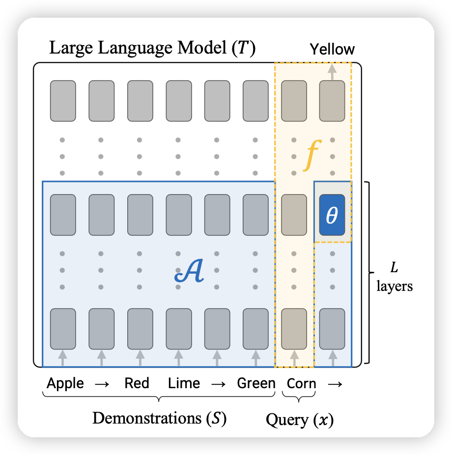

今天的论文不少，但是看起来好像不咋有意思。

仔细想了一下……好像我觉得有意思的论文就那么几家：Meta Deepmind Anthropic Stanford

## [In-Context Learning Creates Task Vectors](https://arxiv.org/pdf/2310.15916.pdf)

deepmind参与的论文，研究了一个事情：LLM在接收到一个task以后，会不会把这个前缀编码成一个所谓的"task-vector"，来形成完成该任务的特定meta-function。

