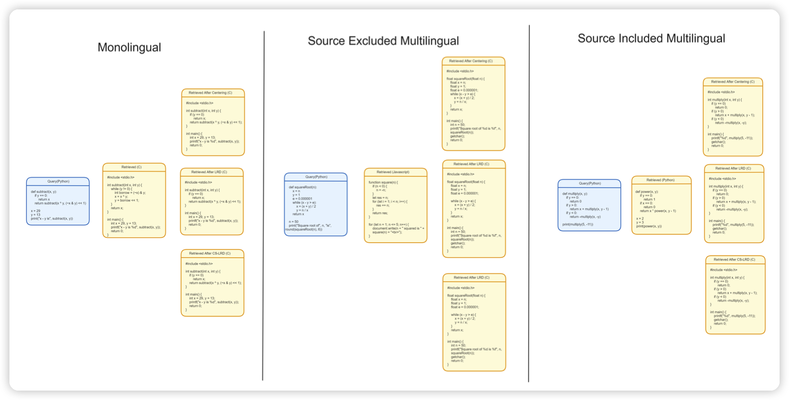

## [Language Agnostic Code Embeddings](https://arxiv.org/pdf/2310.16803.pdf)

作者考虑了在多种编程语言上进行预训练的代码模型的任务表示问题：对于不同的编程语言，模型会编码成不同的code vector吗？

作者发现，code embedding编码了两方面的信息，和编程语言相关的不变量，以及和任务相关的变量

通过解耦这两个概念，作者对于codeT5做到了明显的性能提升

