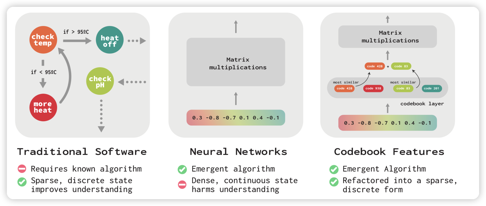

## [Codebook Features: Sparse and Discrete Interpretability for Neural Networks](https://arxiv.org/pdf/2310.17230.pdf)

Anthropic、FAR AI、Stanford的联合作品，探索了一个好玩的问题：大家都想要给hidden state去掉任何的约束，作者觉得这样会使得解释性下降。作者联系了传统软件的特性，尝试把hidden state对齐到一个codebook空间。作者发现这样子模型的表现基本没什么变化，但提高了可解释性。 

