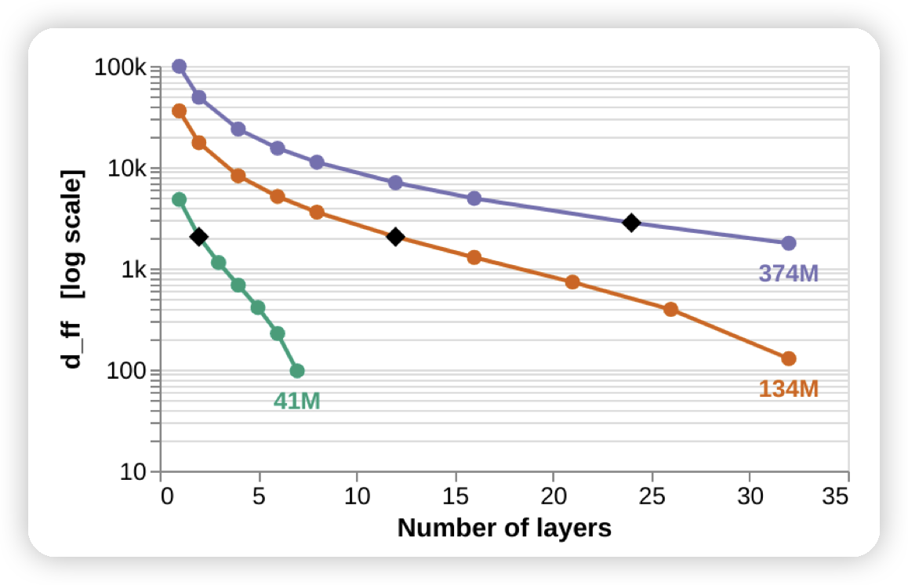

## The Impact of Depth and Width on Transformer Language Model Generalization

deepmind的论文，只解决一个很明确的问题：对于语言建模能力，到底是宽而扁的模型更好，还是深而窄的模型更好。作者做了一系列对比实验，通过各种方法，发现深而窄的模型表现相对更好一些。

很有趣的问题，很有趣的实验设计，很有趣的论文。

