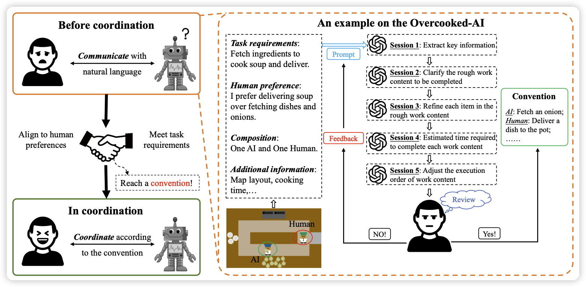
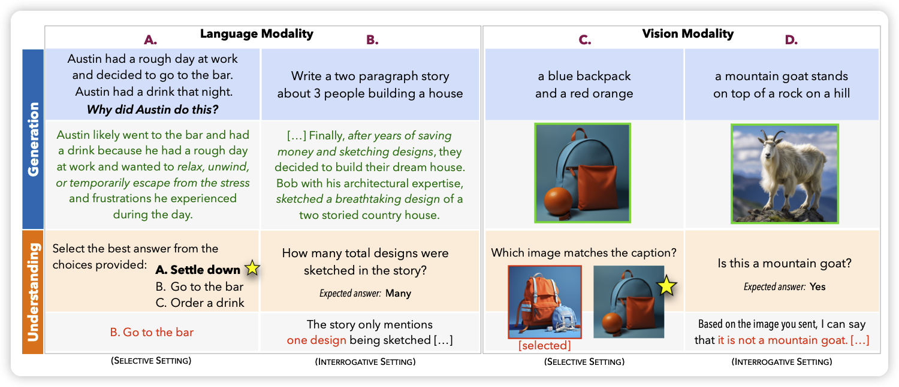

## [Efficient Human-AI Coordination via Preparatory Language-based Convention](https://arxiv.org/pdf/2311.00416.pdf)

一个实际解决任务的过程，往往需要人机协同。作者希望通过一个human-AI多轮对话的形式去协商plan，进而去分工，最终满足双方的需求。

听起来像是下个世代的东西，很新。

## [The Generative AI Paradox: "What It Can Create, It May Not Understand](https://arxiv.org/pdf/2311.00059.pdf)

Yejin Choi的新作。

最近的生成性AI技术受到了前所未有的关注。这些模型能够在几秒钟内产生出与专家水平相媲美或者超越的输出。然而，它们仍然会犯一些即使是非专家也不会犯的基本错误。这给我们带来了一个看似矛盾的问题：为什么这些看似有超人能力的模型仍然会犯一些基本的错误？

也许生成性模型被直接训练为产生专家级的输出，所以它们的生成能力并不取决于（甚至可能超越）它们对这些输出的理解能力。与此相反，对于人类来说，几乎总是先理解、再输出。

作者对模型的理解和生成进行控制实验，发现模型生成更强的模型确实更难理解。因此，评估AI时需要更加谨慎。

