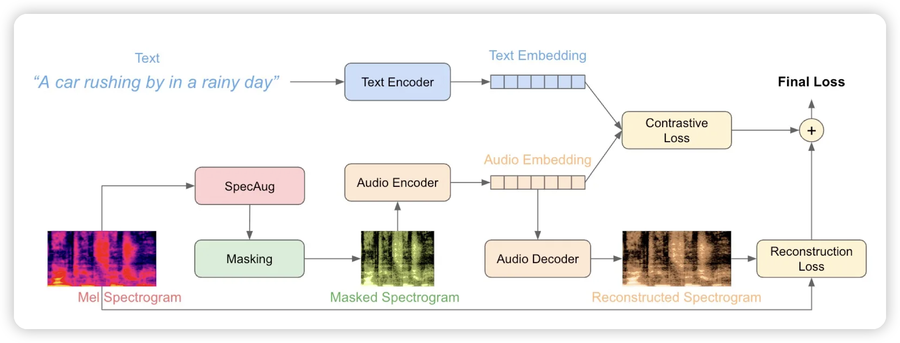

今天是OpenAI开发者大会的日子，从今天开始，抄袭OpenAI新功能的手快论文应该开始工作了。让我们看看第零天有没有产出！

## [FLAP: Fast Language-Audio Pre-training](https://arxiv.org/pdf/2311.01615.pdf)

来自Meta的好文，就是挂的太早了，出现在了今天54篇的最后4篇，要不是翻到了最后，差点就错过了……

讲了一个快速且高效的做 视频-文 模态对齐的工作，达到了新的SOTA。工作流程很简单，如下图所示，总体loss由一个CLIP loss和一个reconstruction loss构成，我就有点好奇这竟然没人试过？不过有趣的是，作者加mask的方式是把视频的一些颜色mask掉，这个方式不知道视频领域常用不常用

