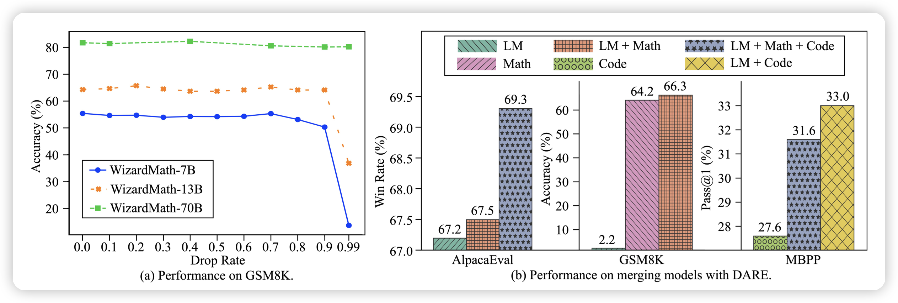

## [Language Models are Super Mario: Absorbing Abilities from Homologous Models as a Free Lunch](https://arxiv.org/pdf/2311.03099.pdf)

少见的中国论文，来自阿里巴巴。

作者发现了delta tuning中，甚至可以大幅的将系数变成0，并且不影响效果(下图左所示，90\%变成0都不咋影响)，有点神奇……作者由此将 WizardLM和 WizardLM Math Code Alpaca蒸馏到一起，发现WizardLM的GSM8K zero-shot甚至比WizardLM Math还高

## [*p*-Laplacian Transformer](https://arxiv.org/pdf/2311.03235.pdf)

这是一篇对transformer结构做改进的论文。神奇的是，四个作者都姓Nguyen，这就是家族论文？

作者搞了一大堆我也卡不太懂的数学推导，最后推出来一个结构，在image任务上比DeiT牛，在text上比普通softmax牛。不过这种论文在实现的时候就是水分很多，具体怎么样可能还要时间检验……这里先列上
