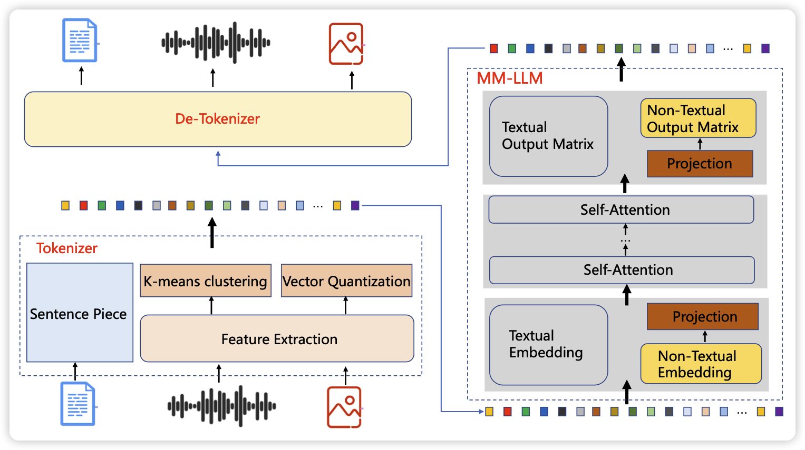
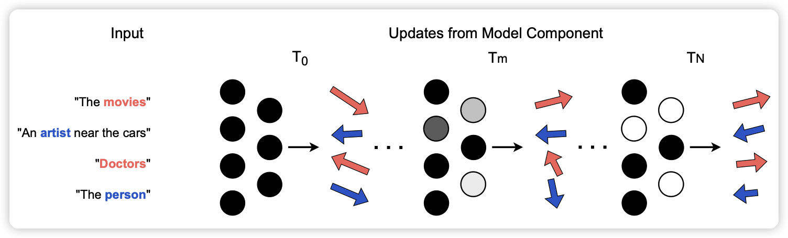

今天论文不多，不过有意思的不少

## [Future Lens: Anticipating Subsequent Tokens from a Single Hidden State](https://arxiv.org/pdf/2311.04897.pdf)

来自南洋理工大学的论文：hidden state真的只包含下一个token的信息吗？作者尝试用$T$位置的hidden state预测 $t \geq T+2$位置的token。在GPT-J-6B上实验，发现准确率超过48%

## [TEAL: Tokenize and Embed ALL for Multi-modal Large Language Models](https://arxiv.org/pdf/2311.04589.pdf)

作者提到目前的多模态模型对于多模态的输入和非语言模态的输出都比较差。作者认为这件事是因为tokenizer。作者提出了一个Tokenize and Embed ALl(TEAL)的方法，把所有模态的数据tokenize到一个统一的词表。最后也可以按照无损的形式解码回来。发现极大地改善了上述问题

## [Uncovering Causal Variables in Transformers using Circuit Probing](https://arxiv.org/pdf/2311.04354.pdf)

作者提出了一个有趣的办法， 通过截断一些计算路径，看看模型会不会丧失某个能力，来嗅探该计算路径代表了什么。

