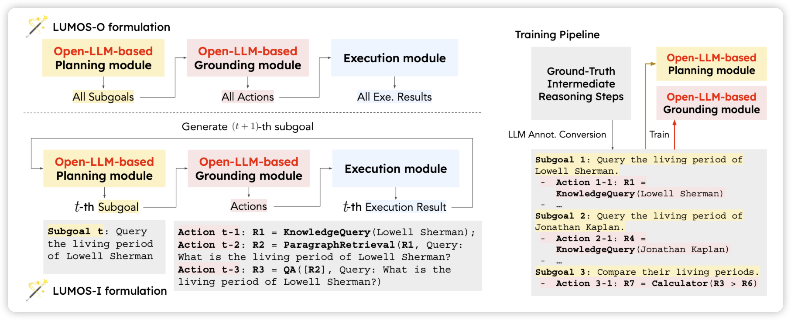
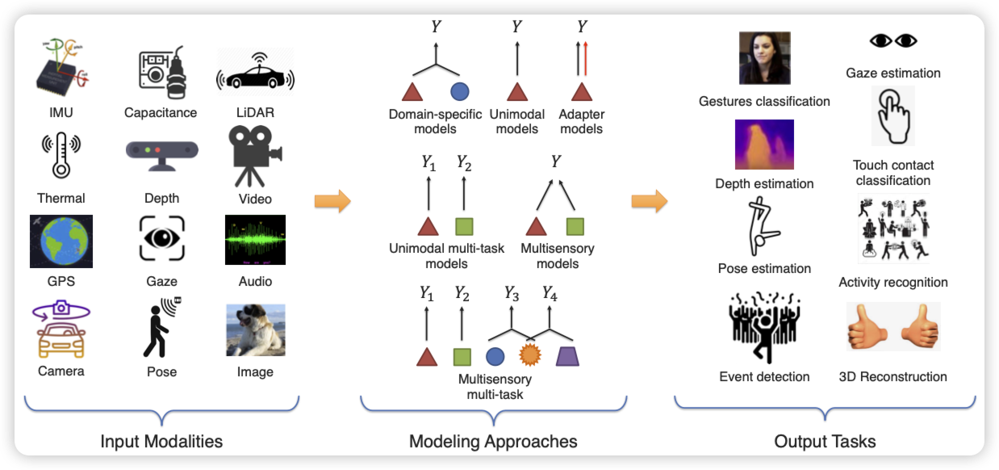
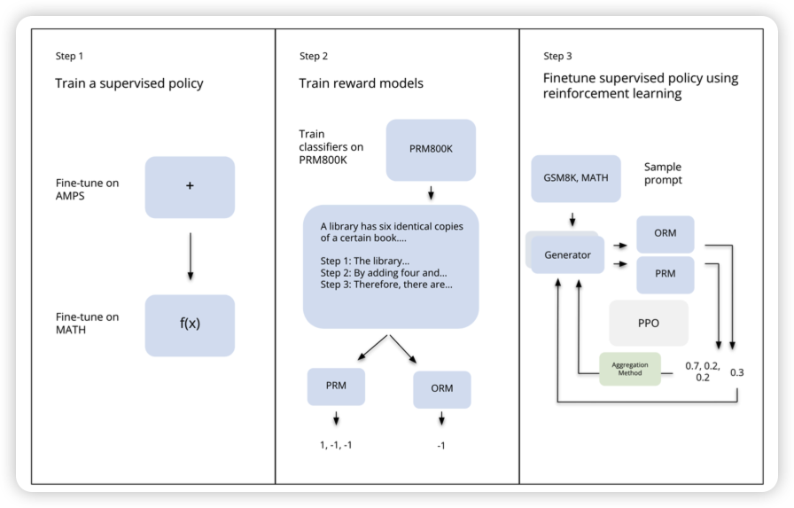

今天的论文数量罕见的少，大家难道都在憋大招嘛……不过虽然论文少，但是有意思的很多，很多我都想写出去。不过鉴于我们的inductive bias，我只能做挑选了

## [Lumos: Learning Agents with Unified Data, Modular Design, and Open-Source LLMs](https://arxiv.org/pdf/2311.05657)

yejin choi也来蹭Agent热度了，大概是造了一大波Agent数据。每个数据都是分三个部分

- plan：模型把任务拆成多个subgoal，每个subgoal都会变成实际的、和工具调用相关的东西
- grounding：一个subtask-handle模型会把subgoal实际变成多步工具调用
- execution：实际执行工具，获得结果

作者发现在用这样的数据训练以后，效果很好，并且可以泛化到没见过的Agent任务上。同时LLama 7B的效果在很多任务上超过了GPT 4

## [MultiIoT: Towards Large-scale Multisensory Learning for the Internet of Things](https://arxiv.org/pdf/2311.06217.pdf)

> IoT：Internet of Thing。很多智能设备相互连接组成的系统，他们通过各种传感器或者什么组件收集和传递信息

stanford对IoT数据集出手了。这是一个数据集类的工作，作者说现在的IoT是一个趋势，但是学界基本没有上规模的数据和测试，也就没法探索这个领域是不是scaling的。作者收集了一个横跨12个模态，8大类task，包含1.15M数据的大数据集，全是IoT任务。认为这会促进这个领域发展

我相信，这绝对会促进这个领域的发展。这也是我把这篇论文选上的原因。学界很多时候不需要创新性很高，但正正需要这样的苦活累活、基础活

## [Let’s Reinforce Step by Step](https://arxiv.org/pdf/2311.05821.pdf)

MIT，有趣的小短文。如果大家之前看过OpenAI出品的Let's verify step by step，我写过一篇。这篇是直接推广，作者把OPT拿过来在数学数据集上fine-tune了一波，然后搞了个OpenAI定义的那个PRM，接着用PRM的step reward搞了PPO

有趣的发现：对于GSM8K这种简单数据集效果不错，但是升级到MATH这种困难的数据集以后，效果就拉了？作者说这对于学界做step reward的RL有指导意义，然后就跑路了

> 我个人感觉啊，和OPT 1.3B有关。基座模型换成LLaMA2 70B或者Wizard LM，没准就work了。这是个not work yet的工作

