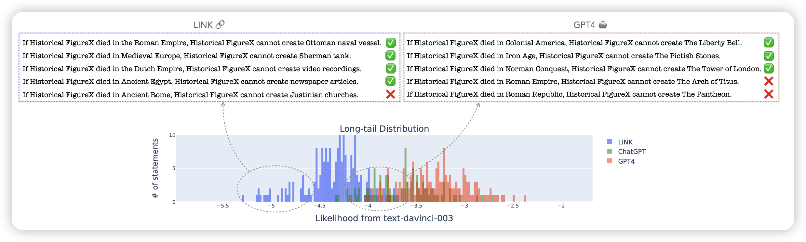
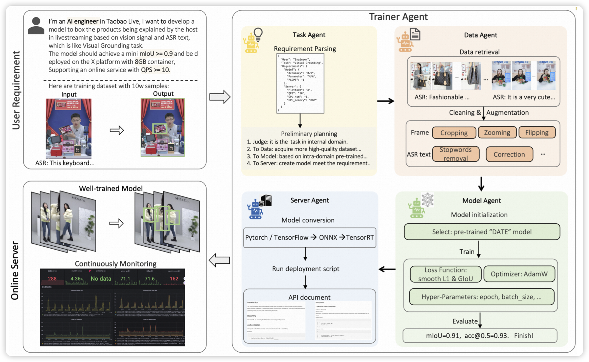

## [In Search of the Long-Tail: Systematic Generation of Long-Tail Knowledge via Logical Rule Guided Search](https://arxiv.org/pdf/2311.07237.pdf)

挺好玩的论文。讲的是目前的LLM测试集一般都是效果太好，score太高失去意义。常见的LLM错误是因为在长尾分布中对罕见知识出错了。然而，通过prompt engineer或者人标注去制作长尾数据很难，因为人也面临同样的问题。作者想了个办法：先prompt模型去生成，再从小概率输出里查看有没有对的。由此构造数据集

## [TrainerAgent: Customizable and Efficient Model Training through LLM-Powered Multi-Agent System](https://arxiv.org/pdf/2311.06622.pdf)

用multiagent system做模型训练，是一个偏应用的论文。作者搭建了一套完备的pipeline，涵盖了从任务planning到数据选择，再到模型训练，最后可视化和部署的多个步骤

