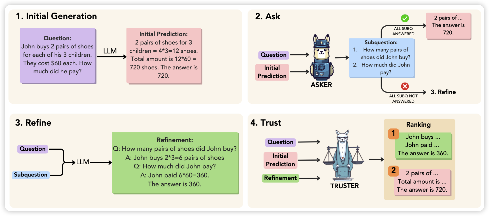
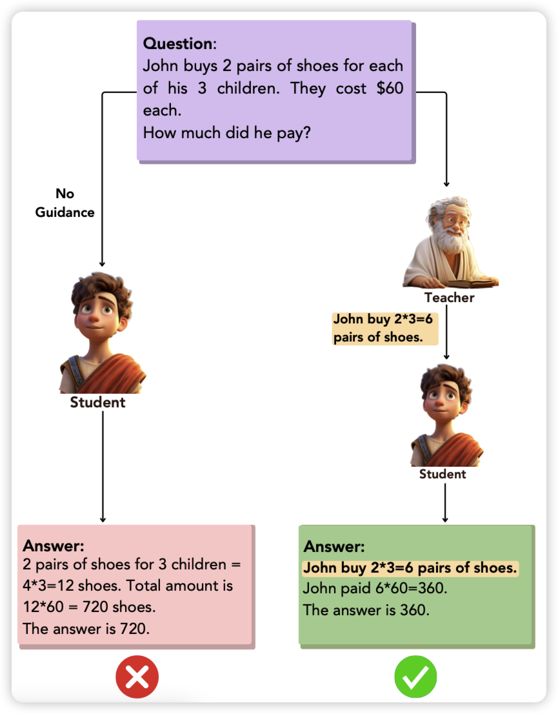
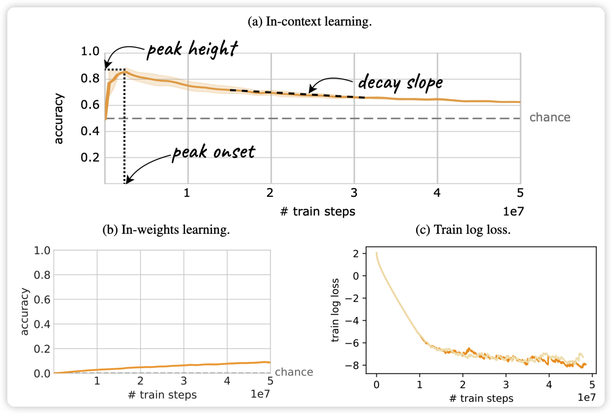
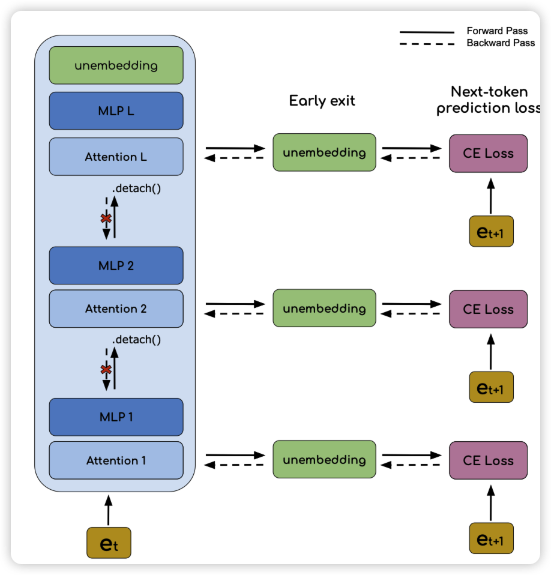

今天两篇论文是同一个作者，所以我算成一篇论文了，那就是一共四篇

## [The **ART** of LLM Refinement: Ask, Refine, and Trust](https://arxiv.org/pdf/2311.07961.pdf)
meta的论文，讲了一个有意思的框架：目前学界对于LLM到底能不能self-refine持有两派观点，有的人任务模型无法发现自己推理中的错误。作者提出的路径是

- 先生成一个CoT和答案
- 接下来让另一个人对着问题和CoT生成subquestion，然后看subquestion是否被正确回答了
- 如果有subquestion没被回答，就看着subquestion重新refine答案
- 最后找一个评判者看refine的答案和原始CoT答案谁好，最终选一个

作者发现这套框架在GSM8K和StrategyQA上有提升

## [First Step Advantage: Importance of Starting Right in Multi-Step Reasoning](https://arxiv.org/pdf/2311.07945.pdf)

这个和上一篇是一个作者，例子都不换，够狂。他探究的问题也挺好玩：reasoning中第一个step重要吗？

作者发现小模型比起大模型，reasoning之所以做错，绝大多数都是第一步就错了。另一方面，作者发现如果找一个大模型把小模型第一步的推理错误纠正过来，效果就能提升超过100%。这个现象在各大大小模型组合上都类似。

这算什么：好的开始是成功的一半？

## [The Transient Nature of Emergent In-Context Learning in Transformers](https://arxiv.org/pdf/2311.08360.pdf)

这是篇我不太好简单解释的论文，deepmind出品。作者的研究目标是：学界有一种思想是ICL能力是emergent出来的，一旦有就不会消失。是这样吗？

作者找了一个数据集，让In-context learning与in-weight learning都能导致好的结果，发现ICL在训练中会先出现后消失。所以作者觉得ICL能力可能是训练中ICL回路和IWL回路互相竞争的结果

我喜欢这篇论文……

## [In-context Learning and Gradient Descent Revisited](https://arxiv.org/pdf/2311.07772.pdf)

这篇论文也是讲ICL，沿着之前那个ICL=gradient descend的故事线。

不过这次作者走得深了一步，发现他们之前有个核心区别：ICL只能看到前面layer的信息流，而GD可以看到deeper layer的信息流。

再走得深了一步，作者说如果把模型结构和训练任务稍微改一改，那么就更像了。作者试了一下，发现这样训练的模型ICL能力变得很强。神奇……

> 把这篇和上一篇放在一起看，就更神奇了

