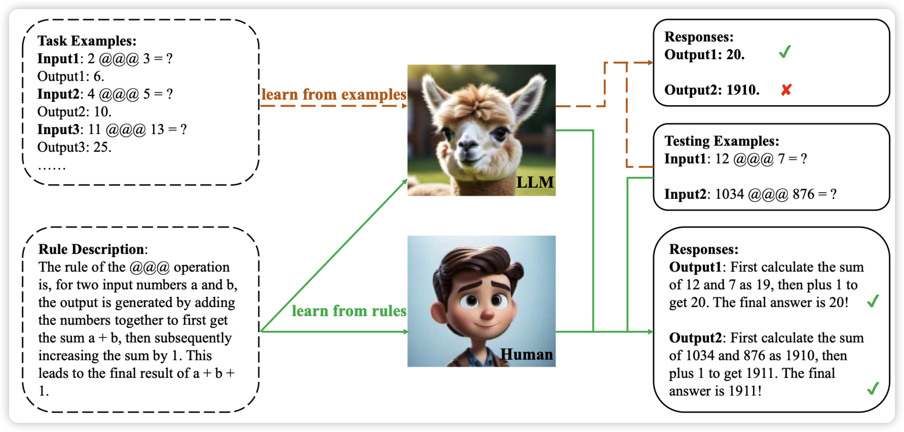
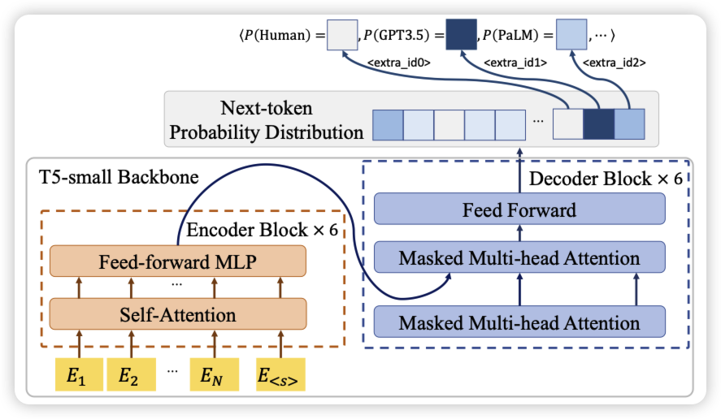
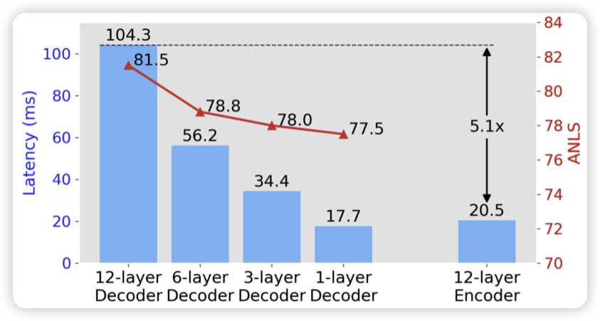

## [Enabling Large Language Models to Learn from Rules](https://arxiv.org/pdf/2311.08883.pdf)

推荐一下师兄的论文，研究了一个挺有意思的推理方面的论文：作者谈到目前的语言模型都是在做learn from example，从一大堆样本猜测function的作用。但人学习的方式可能不是这样，人会先学习某些规律，再通过应用规律到数据上来进行预测。

作者探索了语言模型是否也可以使用这种manner来进行学习

## [Token Prediction as Implicit Classification to Identify LLM-Generated Text](https://arxiv.org/pdf/2311.08723.pdf)

是一篇做LLM文本检测的工作，作者这次直接用一个auto-regressive的next-token-prediction任务来做文本检测，而不是像之前的工作一样用一个classifier。感觉是更直觉的方法呢，我不太了解这个领域，不太清楚经典方法是怎么开展的

## [DEED: Dynamic Early Exit on Decoder for Accelerating Encoder-Decoder Transformer Models](https://arxiv.org/pdf/2311.08623.pdf)
作者发现目前的ENcode-Decoder模型速度慢，主要是decoder每次需要一个个token生成。作者设计了一个early exit的方法，允许decoder根据信心值决定可以提前退出。发现在performance下降法不明显的情况下，做到了减少了60%的用时

