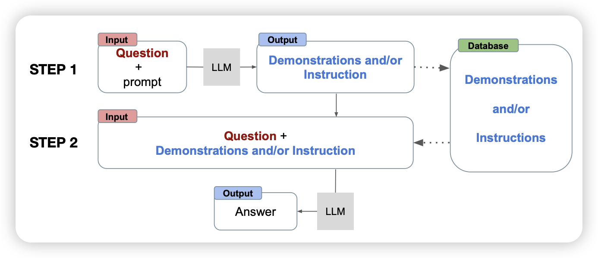
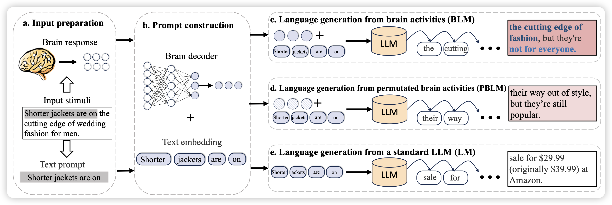

今天的论文好多呀，大家都在卡NAACL匿名期的bug

## [Auto-ICL: In-Context Learning without Human Supervision](https://arxiv.org/pdf/2311.09263.pdf)

furu wei的工作，作者谈到目前的icl需要人工设计形式、输入输出样例。作者思考能不能把人在这个过程中的依赖去掉。作者提了一个二阶段的框架。

- 一阶段收到人类请求，自动生成一些context，包括instruction、example 等等
- 二阶段根据刚才的context去解决该任务

作者发现该framework在传统in-context场景下表现都挺好，同时更灵活

## [Language Generation from Human Brain Activities](https://arxiv.org/pdf/2311.09889.pdf)

刘奕群老师的工作，瞄准的任务是脑机接口领域的"从fMRI脑波中解码人类想说的话"。作者提出了一个新的方法，可以利用一个LLM的语言能力，同时通过一个brain decoder来理解fMRI中的语义，由此生成人fMRI中想要表达的话。这种方法不需要和被试者绑定的输入输出样本，展现了non-invasive braIn-computer interface的巨大潜力。

我不太懂，不过感觉应该是领域内创新性很强的工作

