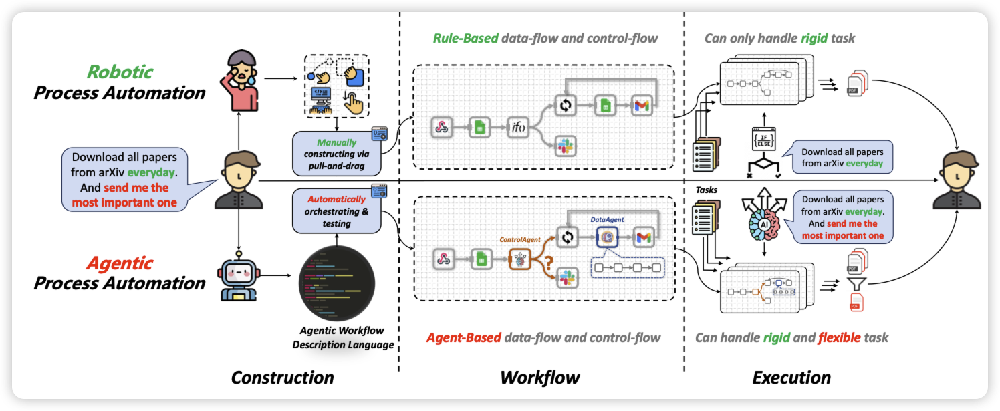
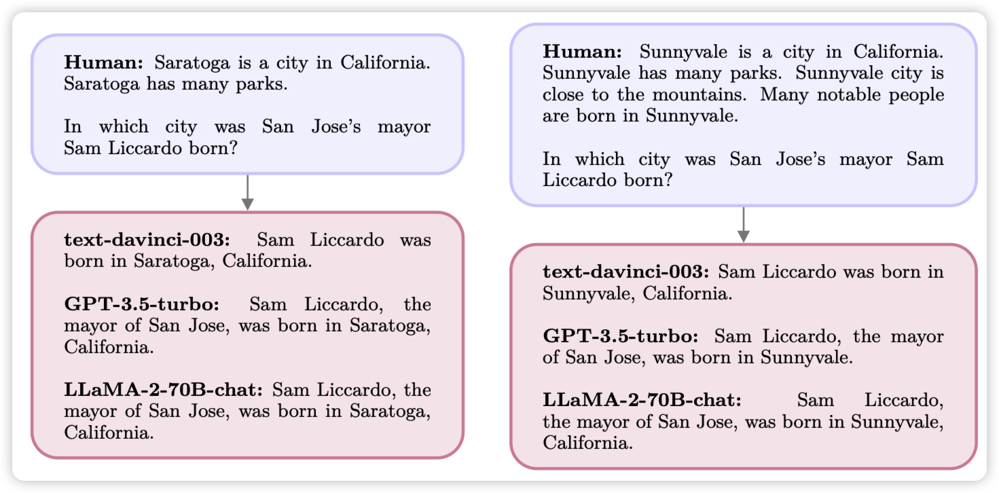

## [ProAgent: From Robotic Process Automation to Agentic Process Automation](https://arxiv.org/pdf/2311.10751.pdf)

推荐一下我的工作……作者探讨RPA技术作为目前最先进的自动化技术，可以自动连接各种APP完成实际需求。然而RPA还要面临两个问题：

- 工作流程需要人类搭建，这个过程耗时比较长，同时效率比较低
- 只能处理结构化数据，对于某些比较灵活的任务，需要处理非结构化数据时就无能为力

现在的LLM-Agent技术正好有灵活性，由此可以提出基于Agent技术的RPA框架，也就是APA。可以让Agent自动完成workflow搭建，同时在workflow执行时通过提前定义的Agent节点来处理非结构化数据，同时可以自动进行决策

## [System 2 Attention (is something you might need too)](https://arxiv.org/pdf/2311.11829.pdf)

来自meta的论文。作者提到目前的Attention算法可以让模型看到所有token对应的hidden state，因此会受到很多和无问题无关的token的影响，比如下图其实前一段和问题无关，但会影响问题的答案。

作者由此提出了一个system2 Attention，先重新生成一遍输入，只包含有关的信息，再回答问题做推理。作者发现这样的模型对输入更鲁棒、事实性更准确

> 话说turbo和Llama2的输入怎么这么像……很难说用了多少turbo的数据做RLHF

## [Exponentially Faster Language Modeling](https://arxiv.org/pdf/2311.10770.pdf)

ETH的研究，作者发现LLM事实上只需要一个很小部分的神经元就能完成一个特定的任务。作者由此把FeedForward层改成了所谓的FFF层，只需要使用12/4096的神经元就能推理。作者在BERT上实验，把推理速度提升了接近80倍，同时score下降不明显。
