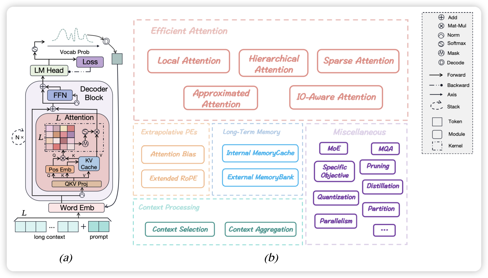

## [Advancing Transformer Architecture in Long-Context Large Language Models: A Comprehensive Survey](https://arxiv.org/pdf/2311.12351.pdf)

南京大学出的一篇长文本的综述，目前这个领域发展火速，最近的综述还是很有看看的必要的。

## [Soft Random Sampling: A Theoretical and Empirical Analysis](https://arxiv.org/pdf/2311.12727.pdf)

IBM research的论文，好少见的机构。作者讨论了在训练数据很大的情况下如何sample训练数据，作者发现了一个sample重合度很低的算法，比起传统sample方法训练更高效。
