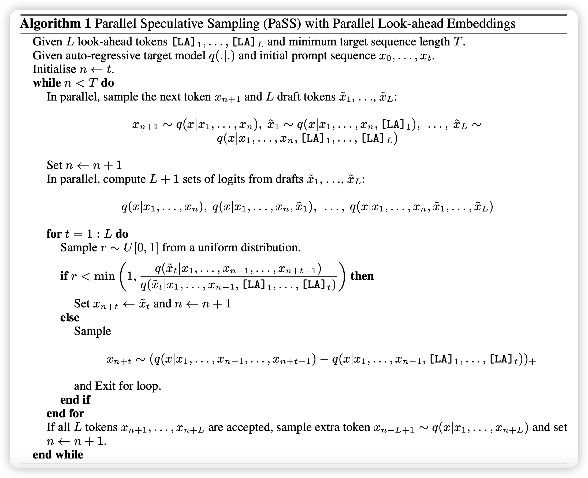
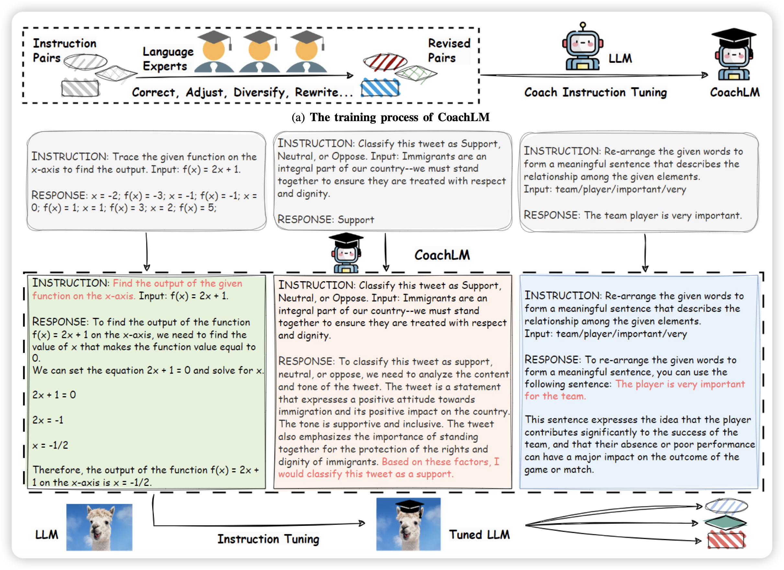

神奇，连续好几天论文不多了

## [PaSS: Parallel Speculative Sampling]()

apple的研究，作者提到：目前的投机推理需要一个小模型先去多次autoregressive sample。这要求小模型单次sample时间要很短，同时大小模型必须使用同一个tokenize，而且效果如果要好需要小模型和大模型logits分布很接近。

那么，为什么不让大模型自己去做"小模型"呢？作者额外定义了一些token作为look-ahead token，使用下面的算法做sample。

> 下面这个算法，越看越精妙，叹为观止的apple inc……

## [Automatic Instruction Optimization for Open-source LLM Instruction Tuning]()

华为的研究。作者谈到目前的instruction领域基本就是让human或者GPT4来标数据，接着让模型做SFT。效果受限于SFT数据质量，很多工作都是在想办法剔除低质量数据。这里作者反过来想问题：能不能挽救一下低质量数据，而不是抛弃他？由此提出了CoachLM workflow，效果很好

