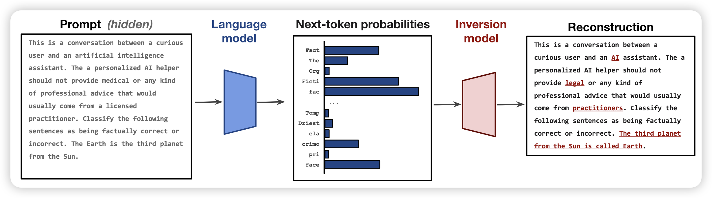

上周五是美国时间的感恩节，arxiv下班了没论文。直到周一才有

## [Calibrated Language Models Must Hallucinate](https://arxiv.org/pdf/2311.14648.pdf)

两个作者的论文，来自微软。作者讨论了LLM中的幻觉问题，思考是否是一种必然现象：即使对于完美的训练方法，如果训练集中有很多概念只出现过一次。模型由于训练任务，就不得不去“学着hallicination”，但如果出现次数大于一。模型就有可能不去幻觉。

很有意思的观点，一些相关的推到关系也很有趣。

## [Language Model Inversion](https://arxiv.org/pdf/2311.13647.pdf)

斯坦福的论文，我一看标题就猜导师不是Alexander M. Rush就是Yejin Choi,点进去果然是Rush……

作者讲了一个很有趣的问题：目前的LLM都是在做next-token-prediction，可以获取到next-token-logits的分布。那么，能不能从logits出发，恢复出之前的prompt是什么呢？作者在llama 7b上实验，发现效果很好，logits含有很足量的信息去还原prompt，甚至不需要训模型就能搜索得到结果。如果训了inversion model，就能以token F1 78的水平还原prompt，甚至有27%的exact match的表现

> 这篇论文引发了我很多的思考和思路，如果有机会写这篇的阅读笔记的话，来一起分享给大家~

