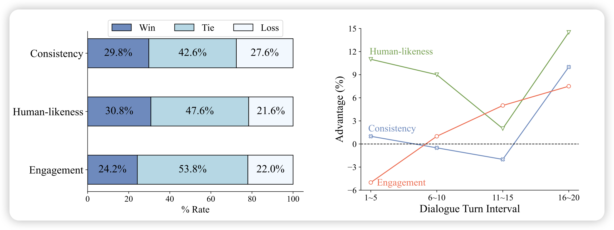

最近医学相关的论文好多呀，标题里一堆Medicine、Radiology的关键词，其实我一个都没读过，不知道这个research line现在发展到哪一步了……

## [CharacterGLM: Customizing Chinese Conversational AI Characters with Large Language Models](https://arxiv.org/pdf/2311.16832.pdf)

推荐一下唐杰、黄民烈老师的工作，这个头像比上次那个老虎的好看多了……

这个工作还是黄老师的主线：对话系统。作者在ChatGLM的基础上训了Character-based Dialogues模型，可以选择role、偏好等等。在人类实验上，作者达到了opensource SOTA，甚至超过了大多数close-source model，包括GPT系。作者开源了其中的6B版本

## [LLaMA-VID: An Image is Worth 2 Tokens in Large Language Models](https://arxiv.org/pdf/2311.17043.pdf)

作者谈到目前的VLM基本上是把图片编码成多个patch-token，这里有个问题：对于vedio，seq-length也太长了。作者搞了简单的办法，直接把一个图片变成了2 token，这样假如一秒一帧，甚至可以存一个1h的视频进去。作者在vedio、image 等benchmark测试了，基本都是SOTA

## [Large Language Models Suffer From Their Own Output: An Analysis of the Self-Consuming Training Loop](https://arxiv.org/pdf/2311.16822.pdf)

作者谈到，近期有一个趋势就是在模型自己生成的数据上训练，去得到一个next-generation of model。然而，这种方法长久吗？作者设计了一系列实验，来探索这个问题。发现在初期，模型的quality和diversity会上升，但随后会下降。最终的稳定性取决于数据中真实数据的比例

>  让我想起了不久前的另一篇论文Self-Consuming Generative Models Go MAD，是在cv领域探索这个事情
