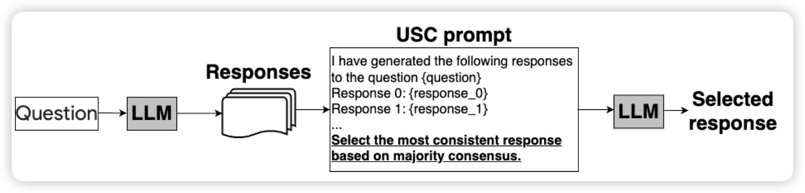
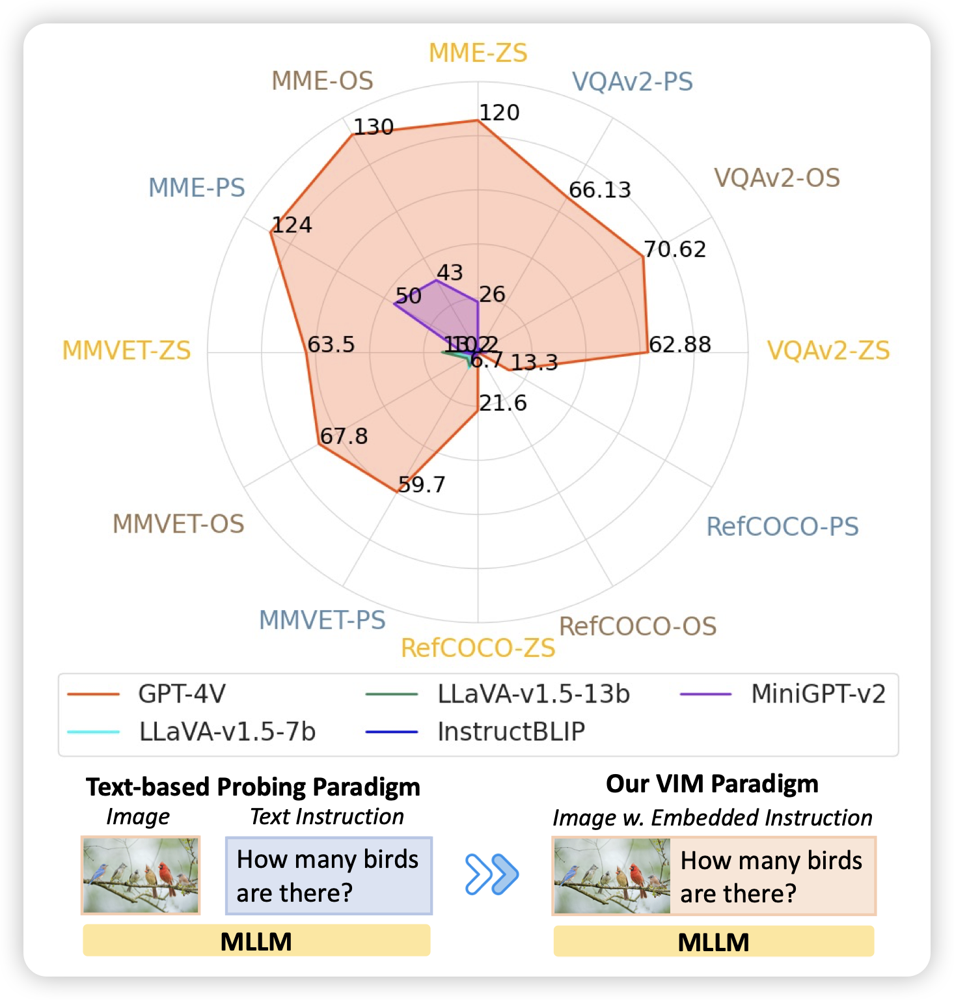

## [Universal Self-Consistency for Large Language Model Generation](https://arxiv.org/pdf/2311.17311.pdf)

Google的论文，好像有几天没看到他们了。作者谈到一个问题，目前的self-consistency类的方法要求有个标准答案，或者起码可以把set中所有元素聚合成一些cluster，这对于free-form answer是不可行的。

作者把这个困难offload给模型，让模型自己选。这样就能在free-form answer上做self-consistency了。进一步的，对于数学这种有答案的场景，也不需要符合特定的格式，任何回答都可以。

> 不过我大致看下来，需要context能乘下多个样本才行

## [VIM: Probing Multimodal Large Language Models for Visual Embedded Instruction Following](https://arxiv.org/pdf/2311.17647.pdf)

Yejin Choi的论文，作者想了个怪招：如果把MLLM task中的文本instruction用图片的形式和原始图片拼在一起会怎么样？把常见的VQA*v2, MME, MM-Vet, and Ref- COCO*等任务都这么搞了一遍，发现除了GPT-4V以外的模型全傻了……这说明实际上开源模型和4V差距比想象中大呀

> 我感觉开源模型都是蒸馏的4v，所以只有在数据里有的场景才能和4v比比。只要出怪招，基本都是寄……

