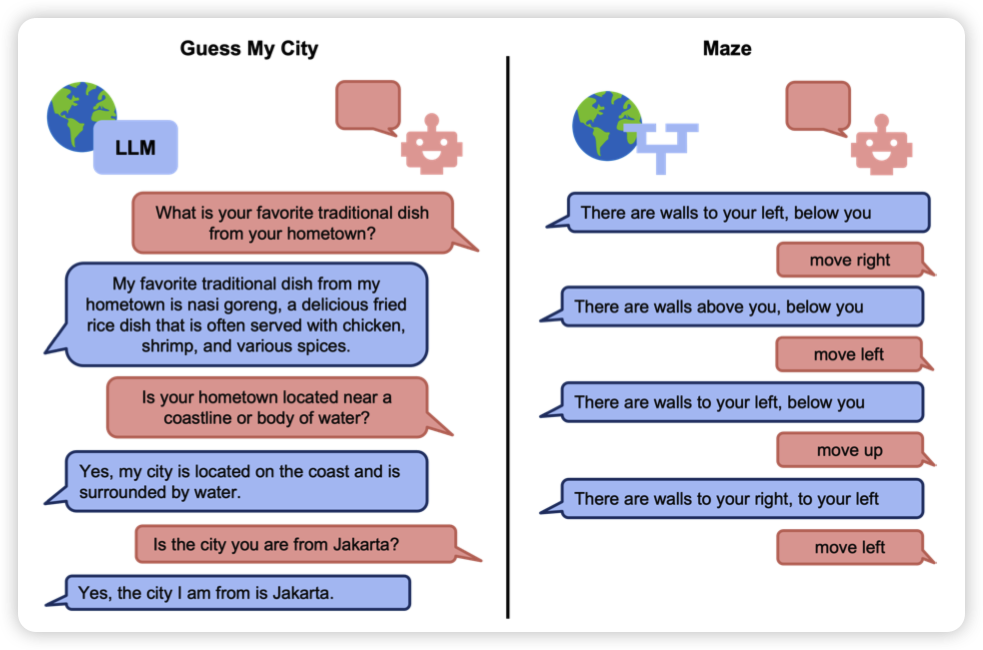
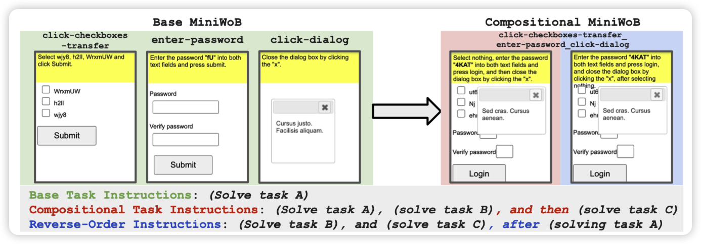
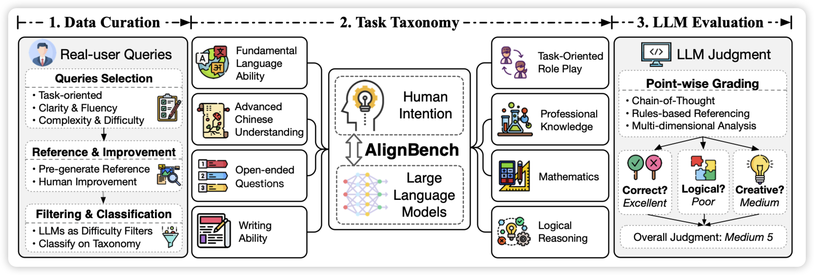

看起来ICLR的投稿逐渐出现在arxiv上了……前面还有7000篇等着跳出来

## [LMRL Gym: Benchmarks for Multi-Turn Reinforcement Learning with Language Models](https://arxiv.org/pdf/2311.18232.pdf)

deepmind和Berkeley的作品，有点像唐杰老师之前的agentbench，定义了一些需要多轮对话来完成的任务，然后把这个事情formalize成了一个multi-turn RL。搭了一个框架，提供了一些基础的算法实现，希望可以指导这个领域积极发展。

> 经提醒，ICLR review 5 6 5 5

## [Language Model Agents Suffer from Compositional Generalization in Web Automation](https://arxiv.org/pdf/2311.18751.pdf)

也是deepmind的工作。作者谈到GPT4对于单个MiniWoB任务上效果很好95%，但如果组合多个任务在一起，就只能做到25%。作者构造了一些task组合的数据集。

> 我觉得这个是不是也是模型fine-tune的局限性，和昨天Yejin Choi那个怪招有点像，来个训练集没有的直接就崩了

## [CRITIQUELLM: Scaling LLM-as-Critic for Effective and Explainable Evaluation of Large Language Model Generation](https://arxiv.org/pdf/2311.18702.pdf)

## [AlignBench: Benchmarking Chinese Alignment of Large Language Models](https://arxiv.org/pdf/2311.18743.pdf)

这两篇都是唐杰老师的工作，应该是按照论文“最小发布单元”的理论分成两篇了，我就算成一个了。

作者说目前的LLM对比评测，尤其是中文评测，基本都是找GPT4打分。但具体做得都不够solid，作者搞了一系列pipeline来提升评测的准确性。并由此专门训练了一个score-model，达到了GPT4 95%的评测效果。

