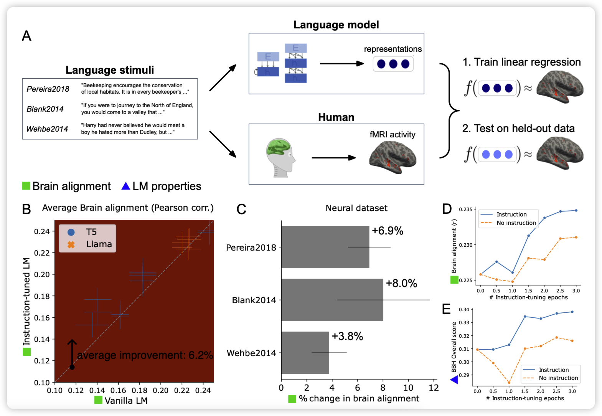
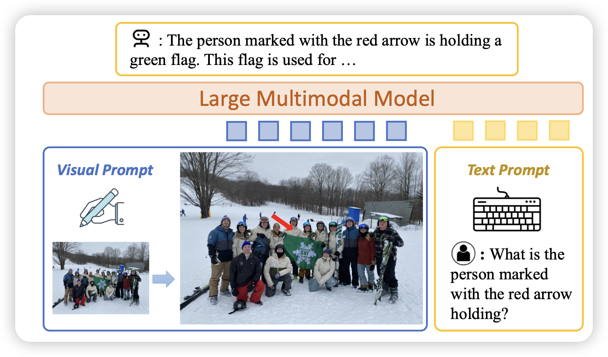

## [Instruction-tuning Aligns LLMs to the Human Brain](https://arxiv.org/pdf/2312.00575.pdf)

EPFL的论文，有点像之前Stanford那篇"惊讶度"的论文，作者观察了instruction tuning的训练是不是会让模型的分布更好的对齐到人脑的想法。从两个方面去探索：

- brain alignment：hidden state和人脑理解的方式是不是对齐的
- behavioral alignment: 行为上的对齐

作者发现，模型instruction tuning后对齐程度基本上都会有提升。越强的模型在instruction tuning阶段的提升越明显。挺好玩的研究

## [Making Large Multimodal Models Understand Arbitrary Visual Prompts](https://arxiv.org/pdf/2312.00784.pdf)

LlaVa团队的作品。研究一个很小的，但是实际应用价值很大的问题：开源的Multimodal model如何获得visual prompt following的能力，比如图里面，给image加上箭头或者圈起来，模型能感知到吗？

作者专门给这个任务做了特训，然后提出了一个vipBench测试这个能力，最后开源了数据、代码、模型

