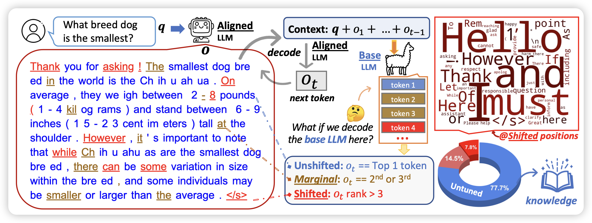
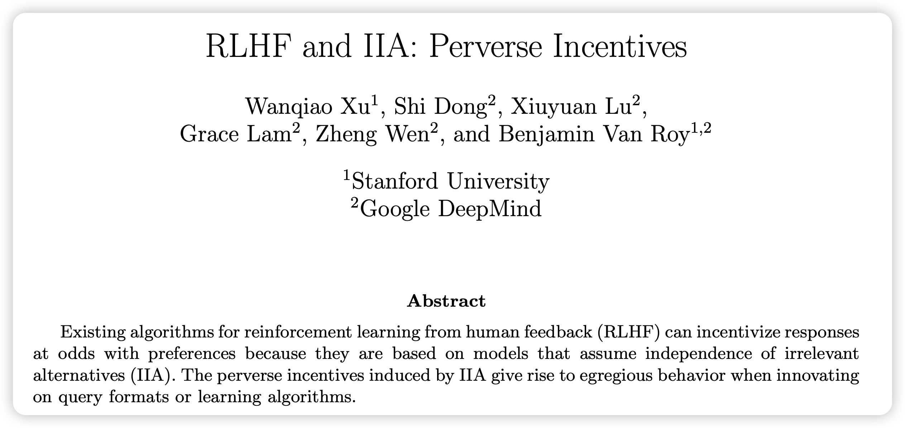

虽然是周二，不过今天看起来还好，没有论文爆炸

## [The Unlocking Spell on Base LLMs: Rethinking Alignment via In-Context Learning](https://arxiv.org/pdf/2312.01552.pdf)

Yejin Choi又来点子了：她发现有研究表明，SFT阶段即使只用1k数据也能获得效果。那么，SFT(+RLHF)的训练到底让模型获得了什么能力？

作者做了Llama2和Llama2-chat的topk分析，发现：在绝大多数token上，他们的top-k没区别，只有在一些style token上会有区别。这说明：SFT也许只是让模型学会了如何在风格上像AI-assistant，但回答问题用的知识、推理等等来源于预训练。

再进一步，既然如此简单，那么能不能不训练，直接用in-context learning呢？作者直接用了3-shot样本+system prompt，就让一个没有对齐的模型看起来像是对齐了。在对齐任务上甚至做的更好

> 不愧 Yejin Choi，个人风格很强

## [RLHF and IIA: Perverse Incentives](https://arxiv.org/pdf/2312.01057.pdf)

是的，摘要就这么短。

>  IIA叫做无关变量独立性，引入别的的样本不影响原本样本的选择。举个例子：你问我"更喜欢梨还是喜欢苹果"，回答是喜欢苹果。这个时候，如果引入橘子，然后问"更喜欢梨还是喜欢苹果"，答案应该还是喜欢苹果。橘子的引入不影响之前概念的相对关系。

作者认为，RLHF场景引入这个假设是有问题的。

>  感觉有道理呀……prompt领域比较火的self-consistency方法，似乎就是建立在非IIA假设上的？

## [Transformers are uninterpretable with myopic methods: a case study with bounded Dyck grammars](https://arxiv.org/pdf/2312.01429.pdf)

一作是华子。作者主要表达的观点是：目前很多transformer可解释性研究都试图在局部(某attention层)还原computation path，试图找到一些可解释的pattern。然而，作者说明局部可能没有任何pattern，全局的pattern在局部看起来很可能是"类随机的"。因此，局部的可解释性研究可能是有误导性的伪研究，撞运气没准能发现一个"pattern"。
