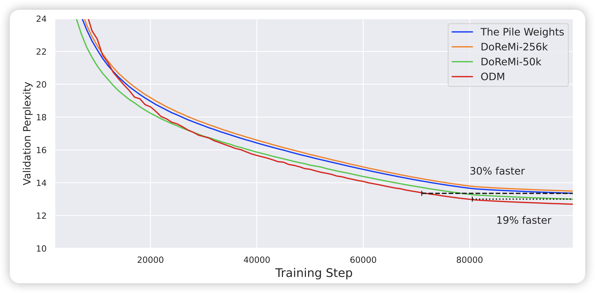
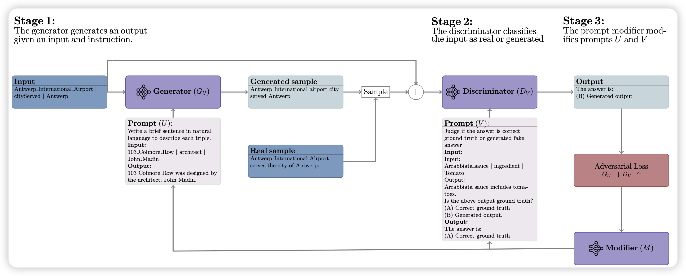

## [Efficient Online Data Mixing For Language Model Pre-Training](https://arxiv.org/pdf/2312.02406.pdf)

预训练数据的选择对模型的最终表现至关重要。有些Active Learning的方法去选择下一个训练数据，但这样的方法效率太低了。另一类方案是自动选择dataset各个subset的比例，这里的优势在于只用选择有限个cluster的比例，因此效率很高。

作者提到，目前的sbuset选择方案需要预先选择好再开始训练，不能处理模型的动态能力提升。作者想到了一种online的方式，可以根据训练情况动态选择各个subset的比例，比之前的SOTA算法DeReMi效率和效果好。

## [Prompt Optimization via Adversarial In-Context Learning](https://arxiv.org/pdf/2312.02614.pdf)

作者提出了一套对抗的Automatic Prompt enginnering框架。用一个generator和一个discriminator相互对抗：每轮generator生成一批数据，discriminator说对不对。然后另外有一个prompt modifier根据discriminator的分辨情况分别去修改两者增强的prompt。

经过这种对抗攻击，作者提到在很多下游任务上可以自动搜索出表现很好的prompt。

## [Training Chain-of-Thought via Latent-Variable Inference](https://arxiv.org/pdf/2312.02179.pdf)

google的论文，经典一张图都没有。作者谈到，CoT通过生成中间的rational来最终完成答案。作者想要自动构建CoT数据做finetune来让模型获得CoT能力。其中的问题是，没法保证(自动检验)中间Rational的正确性。作者提出了一套markov-chain Monte-Carlo的方法，可以平衡多个链路的后验概率。

作者在GSM8K and the tasks in BIG-Bench Hard做测试，发现效果提升超过STaR、CoT-prompt tuning
