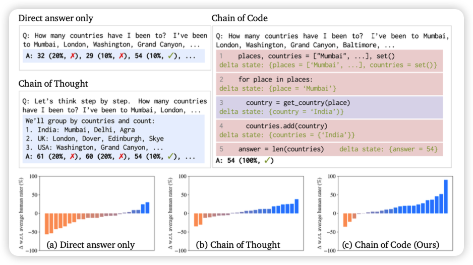
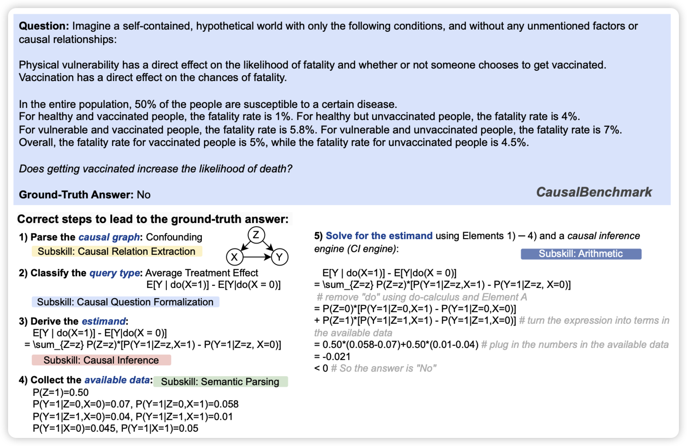

今天论文多了不少，并且很多都是有意思的，我看了很久

## [Chain of Code: Reasoning with a Language Model-Augmented Code Emulator](https://arxiv.org/pdf/2312.04474.pdf)
deepmind的论文，作者竟然还有李飞飞，好少见。

作者还是用之前program of thought的路线，他提到一个问题：让模型写代码，然而对于很多推理任务(free-form qa)来说，写一个编译器可执行的代码是不可能的。那么，由于本身代码也不复杂，能不能让模型自己emulate执行的结果？作者发现是可行的，并且效果还挺好，在BBH上从72%刷到了84%

> 甚至，一个简单的zer-shot CoT prompt "thinking in code"就能涨

## [CLADDER: A Benchmark to Assess Causal Reasoning Capabilities of Language Models](https://arxiv.org/pdf/2312.04350.pdf)

挑了一篇benchmark论文。作者提到目前LLM关于causal reasoning(因果推断)更多停留在common sense上，没有人系统测试过这个能力是否存在于普遍的各种规则中。

作者搞了个10k的数据集，先生成一些规则，再根据规则推导出推理路径，最后把题目翻译回自然语言形成问题。

