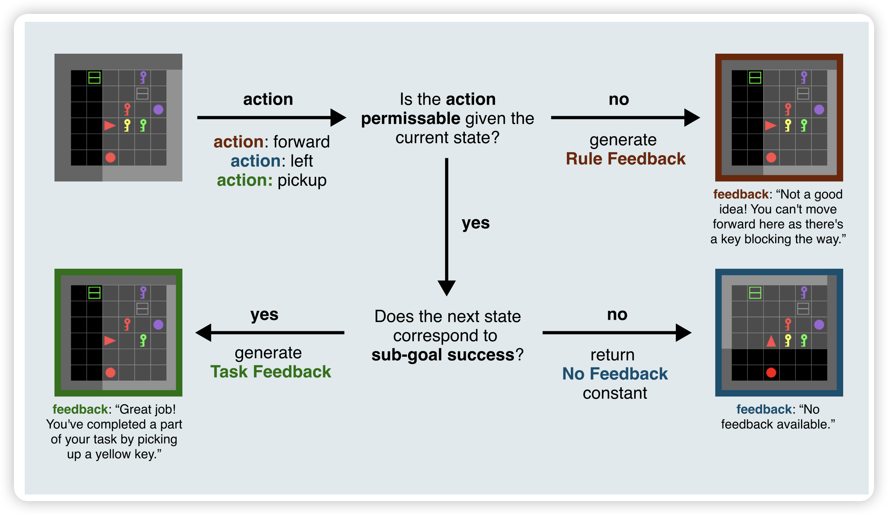
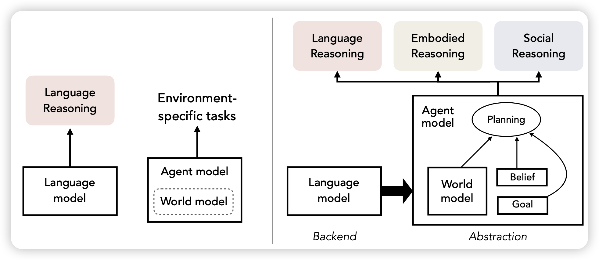

## [Is Feedback All You Need? Leveraging Natural Language Feedback in Goal-Conditioned Reinforcement Learning](https://arxiv.org/pdf/2312.04736.pdf)

一篇有趣的论文，在今年的NeurIPS上。作者提到目前的强化学习速度比起人类的学习速度慢了很多，原因是什么？作者认为人在学习的时候会收到一些自然语言的feedback，蕴含有非结构化的、信息很强的监督信号。

LLM能不能用类似的方式收到NL feedback来做强化学习呢？作者发现可以，而且学习速度很快。甚至在测试时没有feedback都可以

## [Language Models, Agent Models, and World Models: The LAW for Machine Reasoning and Planning](https://arxiv.org/pdf/2312.05230.pdf)

zhiting hu的position paper，先相信。作者提了一套agent任务的high level的思想框架LAW，认为会指导以后的agent方法设计。

具体我没细看，下来仔细读读，要是好的话分享给大家~

