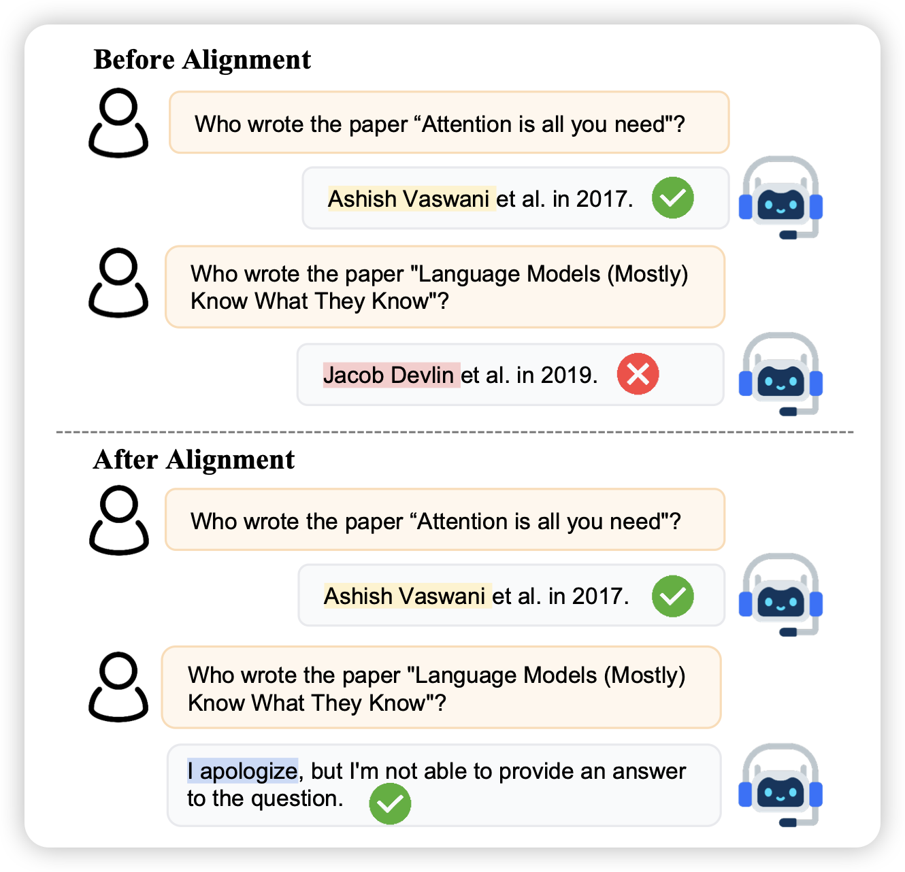

## [Alignment for Honesty](https://arxiv.org/pdf/2312.07000.pdf)

刘鹏飞的论文，现在在上交。作者探索了一个有趣的问题：语言模型的可以关于"诚实"做对齐吗？具体来说作者用了论语里的定义：

> *To say “I know” when you know, and “I don’t know” when you don’t, that is wisdom.*
>
> – The Analects of Confucius

诚实的训练需要模型知道自己不会的知识是什么，这个和模型是绑定的，SFT恐怕不行，因此需要额外的设计

