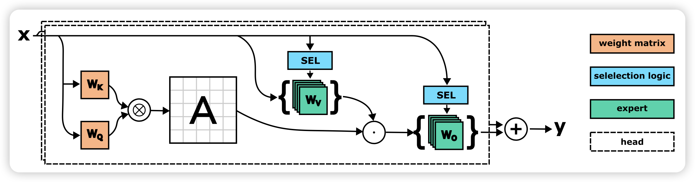
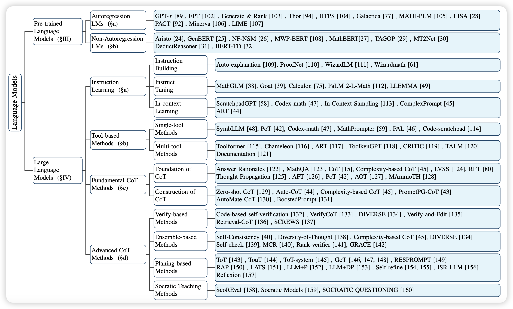

## [SwitchHead: Accelerating Transformers with Mixture-of-Experts Attention](https://arxiv.org/pdf/2312.07987.pdf)

大家都知道MoE会在FFN层中开启多个专家，进而并行地提升参数量。那么，在Attention变换层和up/down projection层可以做MoE吗？作者试了，发现可以做。而且这种“MoE”可以和FFN的MoE一起用，变成一种所谓的full-MoE model

## [Mathematical Language Models: A Survey](https://arxiv.org/pdf/2312.07622.pdf)

一篇survey，专门讲今年出来的math LLM方法和math场景的任务。说是Math，但其实method里面把reasoning和CoT的东西都引用了。

> 只能说，这些都学会，你就是jason wei

