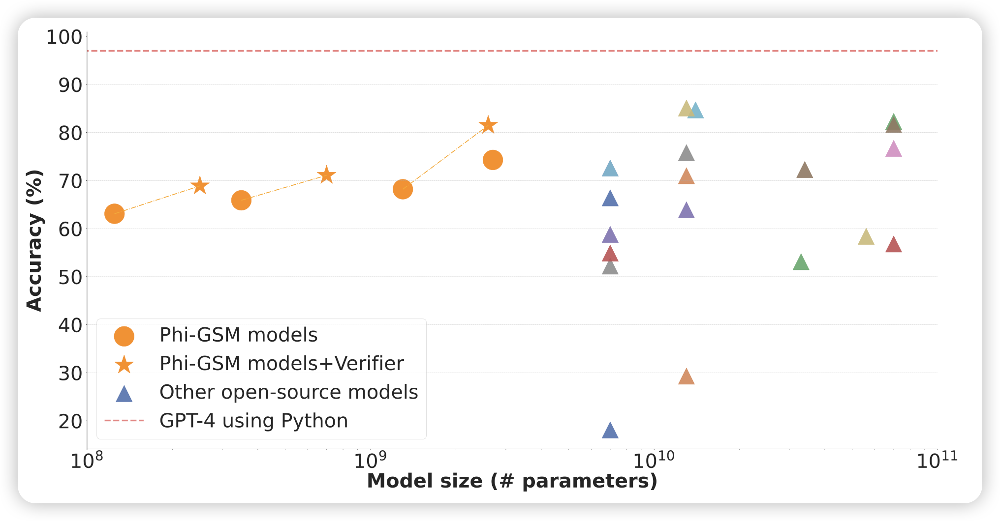
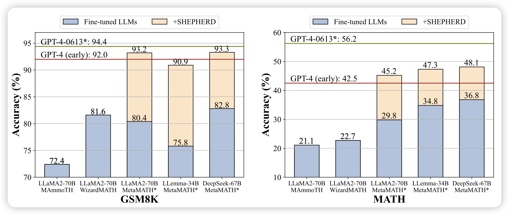

今天找了几个，全是关于Math的

## [TinyGSM: achieving > 80% on GSM8k with small language models](https://arxiv.org/pdf/2312.09241.pdf)

经典的math场景加数据训练的模型，作者用turbo生成了12.5M的GSM8K换皮qa对，然后在phi系列模型上训练。发现数据上去以后，即使125M的模型在GSM8K上的表现都很好

> GSM8K版的MathGLM……但是数据没开源。可惜

## [Math-Shepherd: A Label-Free Step-by-Step Verifier for LLMs in Mathematical Reasoning](https://arxiv.org/pdf/2312.08935.pdf)

之前"verify step by step"里说的step reward model一直没找到开源的实现或者复现，这次作者在MATH和GSM8K上用伪数据训了一个开源版本。发现用step-reward，可以把Math刷到接近50%

> 这个和上面那个结合一下……是不是能把MATH搞到100%

