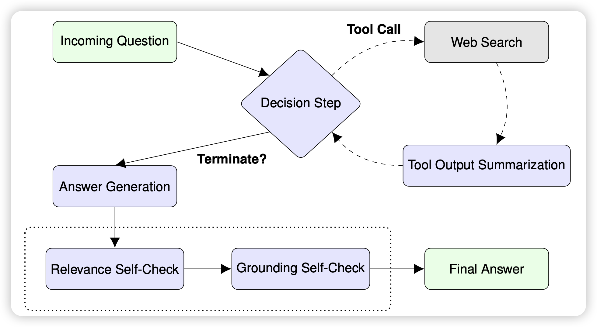
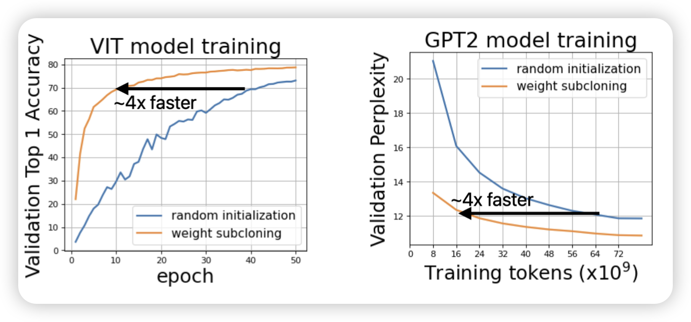

今天是圣诞节前最后一周，估计下一周arxiv又放假了

## [Weak-to-Strong Generalization: Eliciting Strong Capabilities With Weak Supervision](https://arxiv.org/pdf/2312.09390.pdf)

OpenAI的研究，不多说了，今天才上arxiv。我昨天写了一篇blog，可以参考一下：

## [ReST meets ReAct: Self-Improvement for Multi-Step Reasoning LLM Agent](https://arxiv.org/pdf/2312.10003.pdf)

这是google这两周出的第三篇self-train的研究了，神奇的是：竟然是三个不同的团队做的，作者甚至没有重合。

这次作者瞄准了ReACT场景，作者认为目前的已有的一些self-improve的工作更多面向RAG的技术路径，这个方案没法适配到运行时的全新场景去。作者试图用一套self-train的训练方法来解决这件事情

## [Weight Subcloning: Direct Initialization of Transformers Using Larger Pretrained Ones](https://arxiv.org/pdf/2312.09299.pdf)
apple的研究，好少见的单位。作者探索了一个问题：能已有的研究都是用相同规模的模型去初始化另一个去做continue pretraining，但很多时候没有相同规模的模型。那么，能不能一个大模型的权重来初始化一个小模型，使得小模型的训练速度很快？作者探索了一下，发现是可行的。

