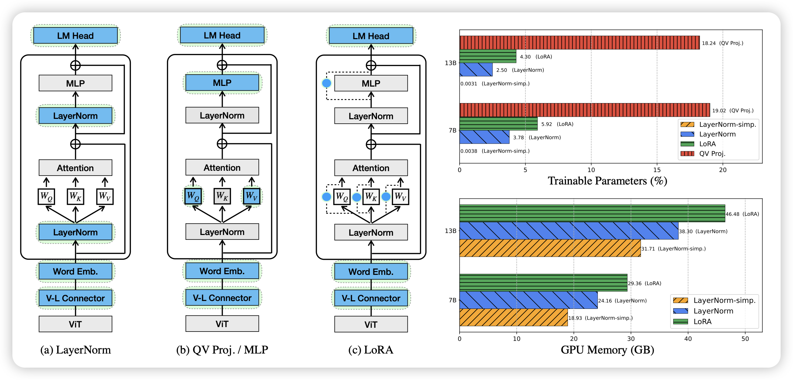
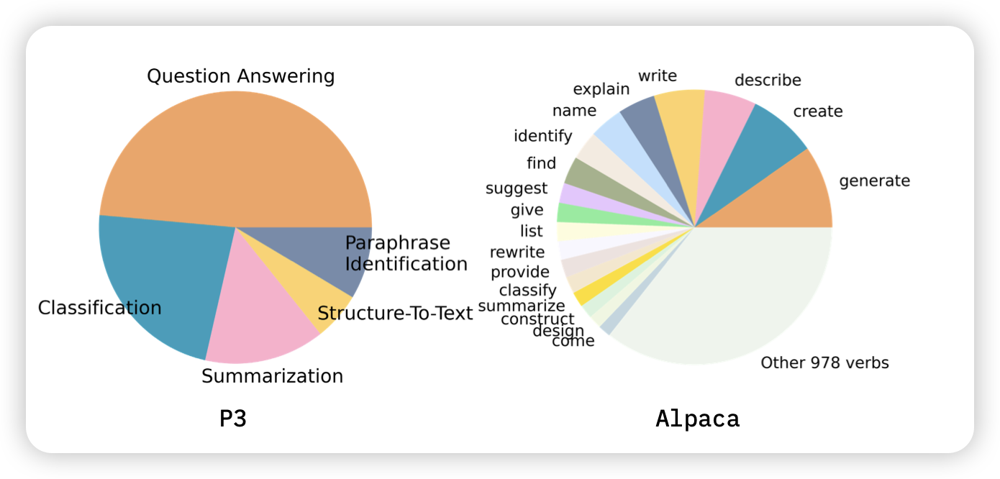
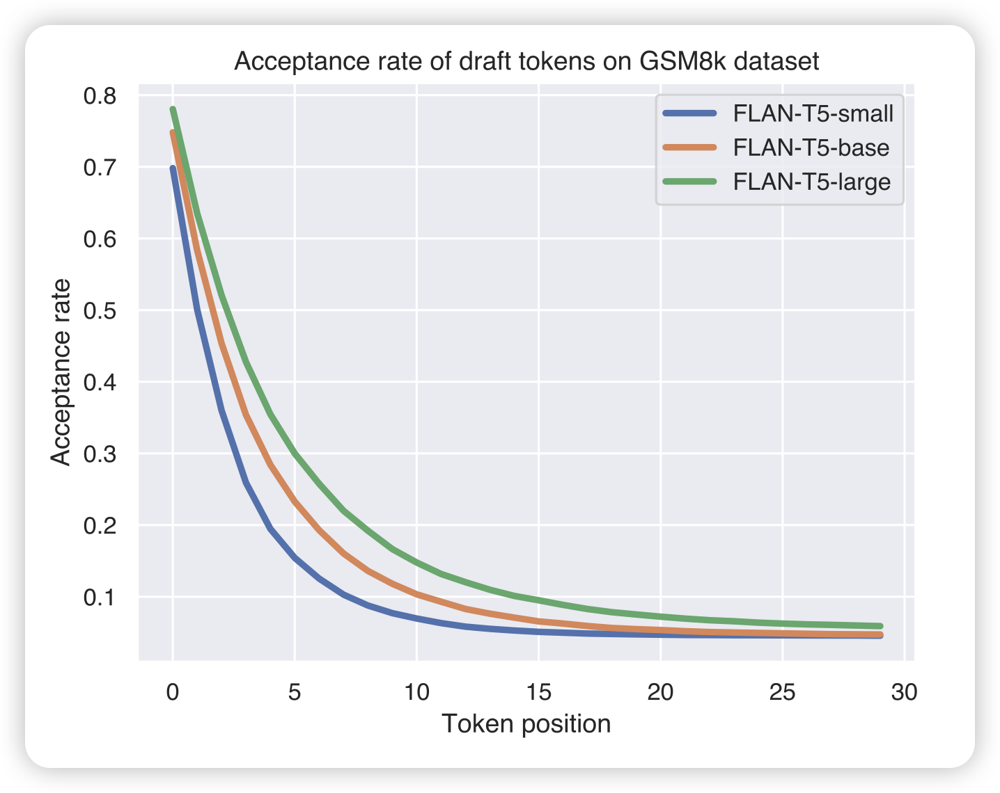

## [Tuning LayerNorm in Attention: Towards Efficient Multi-Modal LLM Finetuning](https://arxiv.org/pdf/2312.11420.pdf)

PET(parameter efficient tuning)领域的文章，如标题那样，作者发现对于multimodal-LM，只调整transformer block内部的layernorm也行，需要的参数比Lora少，同时效果有的时候会更好。

> 神奇……这让我想到：基本MoE干啥说明PET有潜力做这个。目前的MoE基本瞄准MLP，这是不是说明layerNorm也有潜力搞MoE呢？

## [Understanding the Instruction Mixture for Large Language Model Fine-tuning](https://arxiv.org/pdf/2312.10793.pdf)

之前预训练领域有doremi之类的工作探索了每个pretrain-subset的比例对于模型最终效果的重要性。作者希望在instruction tuning领域做一个类似的事情，探索(close-domain) instruction tuning里面不同的任务类型对最终的模型有帮助吗？

- 不同的instruction类型对最终的效果有不同的影响
- 有些类型上做训练，会导致在其他类型上效果下降

> 这让我想起Jason Wei在Flan-Collection里提到不同的instruction set的sample权重的问题，不知道他有没有类似的initial experiment

前面起高了，感觉后面有好几篇都挺好的，可惜今天只剩下一个名额了……

## [Cascade Speculative Drafting for Even Faster LLM Inference](https://arxiv.org/pdf/2312.11462.pdf)

投机推理的论文我应该已经放几篇了：online投机推理、并行投机推理、预测投机推理……今天这位想了另一个问题：投机模型可以视为小模型级联一个大模型，那如果这个级联是递归的，会不会更好呢？

作者搞了一大堆数学，为了让分布和原来模型等价，然后最后发现效果比之前更好更快

> 看起来是ICML喜欢的风格

