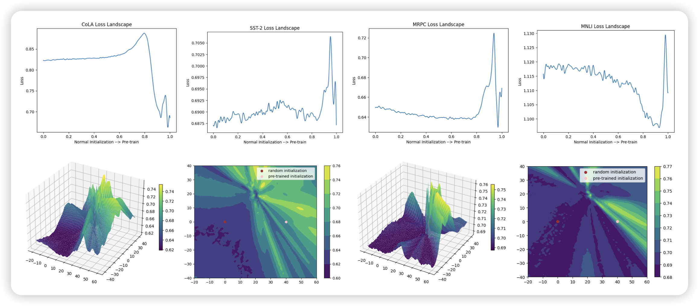

昨天没来得及分享，今天把这两天的都补上

## [Sparse is Enough in Fine-tuning Pre-trained Large Language Model](https://arxiv.org/pdf/2312.11875.pdf)

作者想要探究PET方法的内部机理，为什么PET方法只调整很少的参数就会有用呢？这篇工作中，作者尝试把模型的参数按照某个程度初始化一下，(程度最小就是不动)，作者发现无论怎么训练，基本上都是1%的参数占据了99%的gradient，说明模型的稀疏是一个固有的性质

由此，作者根据参数的gradient提出了一个Sparse Increment Fine-Tuning方法，发现效果也不错

> 经典的ICML偏好的论文形式

