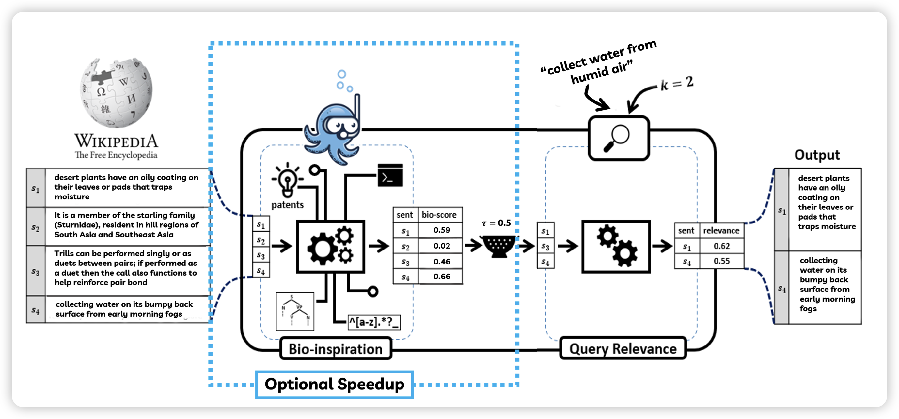

最近AAAI 24的论文开始出来了，其实我挺不喜欢的，感觉AAAI的论文格式字又小，还是左右分栏。相比之下，还是更喜欢NeurIPS和ICLR

## [Imitation of Life: A Search Engine for Biologically Inspired Design](https://arxiv.org/pdf/2312.12681.pdf)

选他不是因为创新性很强，而是因为选题很好玩

作者提到很多研究发现的创新都是从大自然、生物学中寻找灵感，有没有可能设计一个搜索引擎，每当人输入什么现象，就能自动匹配到自然界中和这个很像的植物或者动物的行为、结构呢

